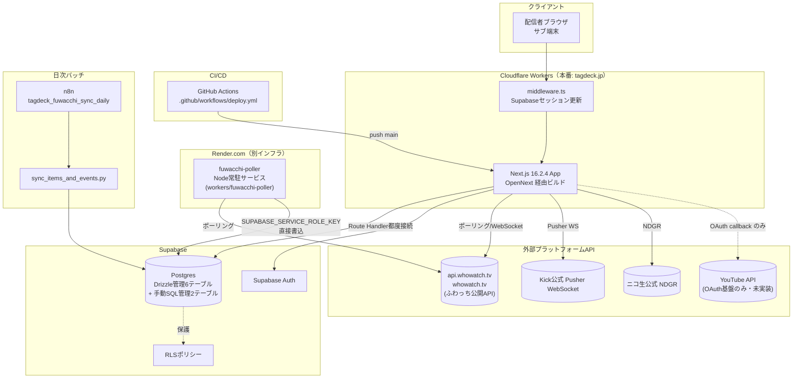

# TagDeck 構成設計書 v1 (2026-07-18)

> 作成: Claude Code（TagTech / モデル Fable 5・社長明示指示によるモデル選択原則 v1.0 原則2 例外・本セッション記述が承認証跡）
> 出典: `docs/inventory/tagdeck_inventory_20260718.md`・`docs/spec/tagdeck_spec_v1.md`（いずれも本セッション作成）およびコード実地確認。
> 不明点は「(要確認)」と明示し、推測での断定は行わない。

---

## 1. システム構成図

**構成上の要点**:
- メインアプリ（Next.js）は Cloudflare Workers（`wrangler.jsonc` / OpenNext経由）で本番稼働。`.open-next/worker.js` がエントリポイント
- `workers/` ディレクトリ配下だが、`fuwacchi-poller` のみ実際には **Render.com** の常駐Nodeサービスとしてデプロイされる（`render.yaml`確認済み）。Cloudflare Workers はCPU時間制約（`AGENTS.md`記載）のため常時ポーリングに不向きで、別インフラに分離されていると推定（要確認: 分離判断の設計文書は本調査範囲で未発見）
- `kick-watcher` / `niconico-watcher` は空ディレクトリで、対応するデプロイ設定も存在しない（要確認: Kick/ニコ生はメインアプリのAPI Route内でリアルタイム処理が完結している可能性）
- `youtube-relay`（26行スタブ）にもデプロイ設定なし

---

## 2. データフロー

### 2-1. リアルタイム監視フロー（ふわっち例）
1. 配信者がダッシュボードで監視ON → `POST /api/platforms/fuwacchi/monitor` → `streamer_profiles.fuwacchi_is_monitoring = true`
2. クライアント側 `useFuwacchiMonitor` フックが `POST /api/platforms/fuwacchi/poll` を定期呼び出し → `api.whowatch.tv` へポーリング → 結果を `streamer_profiles.fuwacchi_viewer_count` 等に反映
3. 別経路として Render.com 上の `fuwacchi-poller` が独立して稼働（用途・NextApp側pollingとの役割分担は要確認）

### 2-2. イベントシミュレーターフロー
1. `POST /api/events` でイベント作成（Zodバリデーション→Drizzle insert、`event_simulators`テーブル）
2. `GET /api/events` でSupabase認証ユーザーのアクティブイベント一覧取得
3. ランキング型イベントは `POST /api/events/[id]/refresh-ranking` でライバル順位を再取得（`fuwacchi-ranking.ts`のスクレイピングロジック使用）
4. `src/lib/events/monte-carlo.ts`（モンテカルロ法）+ `bayesian.ts`（経験ベイズ事後推定）で目標達成確率を計算しクライアントに返却

### 2-3. ふわっちイベント/アイテムマスタの日次同期
1. n8n ワークフロー `tagdeck_fuwacchi_sync_daily`（`data/n8n_workflows/`）が毎日0:00 JSTにトリガー
2. `scripts/platforms/fuwacchi/sync_items_and_events.py` を実行 → `fuwacchi_events`・`item_point_mapping`テーブルを更新
3. 実行ログは `logs/fuwacchi_sync_YYYYMMDD.log` に記録（2026-05-09〜2026-07-06まで継続確認済み、直近は2026-07-06）

### 2-4. 認証フロー
1. `middleware.ts` が全リクエストでSupabaseセッションを検証・更新（`updateSession`）
2. ルート`/`アクセス時、セッションありなら`/dashboard`へリダイレクト
3. OAuth連携（Google/YouTube想定）は `src/app/auth/callback/route.ts`（29行）で処理

---

## 3. DBスキーマ全テーブル一覧

### 3-1. 現行スキーマ（`src/lib/db/schema.ts` 9テーブル）

| # | テーブル名 | 列数（概算） | 管理経路 | fuwacchi関連列 |
|---|---|---|---|---|
| 1 | `users` | 5 | Drizzle (0000) | なし |
| 2 | `streamer_profiles` | 27 | Drizzle (0000) | `fuwacchi_user_id`, `fuwacchi_live_id`, `fuwacchi_is_monitoring`, `fuwacchi_monitoring_started_at`, `fuwacchi_last_polled_at`, `fuwacchi_viewer_count`, `fuwacchi_current_points`, `fuwacchi_peak_viewer_count`（8列） |
| 3 | `listeners` | 9 | Drizzle (0000) | なし（`platform`列に`'fuwacchi'`文字列値） |
| 4 | `events` | 9 | Drizzle (0000, 0004で3列追加) | なし（`platform`列に`'fuwacchi'`文字列値） |
| 5 | `event_simulators` | 20 | Drizzle (0000系, 0006でFK列追加) | `fuwacchiEventId`列 |
| 6 | `event_history` | 14 | Drizzle (0000系) | なし |
| 7 | `item_point_mapping` | 11 | **手動SQL**（`supabase_phase5c_item_mapping.sql` + `_extension.sql`） | `platform`列に`'fuwacchi'`値 |
| 8 | `fuwacchi_events` | 9 | **手動SQL**（`supabase_phase5c_extension.sql`） | テーブル名自体が`fuwacchi_events` |
| 9 | `youtube_oauth_tokens` | 9 | Drizzle (0005) | なし |

### 3-2. whowatch統一後の対比表（草案・仕様書§8-1の社長回答待ち）

以下は仕様書 `docs/spec/tagdeck_spec_v1.md` §8-1 の選択肢A（内部識別子のみ統一・UI表示は「ふわっち」のまま）を採用した場合の想定変更点。**社長回答前につき未確定・実装しない。**

| 現行 | 統一後（案） | 対象 |
|---|---|---|
| `streamer_profiles.fuwacchi_*`（8列） | `streamer_profiles.whowatch_*` | DB列名（要マイグレーション） |
| `event_simulators.fuwacchi_event_id` | `event_simulators.whowatch_event_id` | DB列名（要マイグレーション） |
| `fuwacchi_events`テーブル | `whowatch_events`テーブル | テーブル名（要マイグレーション・手動SQL経路のため通常のdrizzle-kit generateでは追跡不可な点に注意） |
| `Platform = "fuwacchi" | ...` | `Platform = "whowatch" | ...` | TypeScript型リテラル（`platform`列の既存データ値も移行対象） |
| `FUWACCHI_DEVICE_ID` | `WHOWATCH_DEVICE_ID` | 環境変数名（.env.local, Cloudflare Secrets, GitHub Actions Secrets 全箇所） |
| `src/lib/platforms/fuwacchi.ts` 等ファイル名58件 | `whowatch.ts` 等 | ファイル名・ディレクトリ名 |
| `useFuwacchiMonitor`, `FuwacchiSettings` 等 | `useWhowatchMonitor`, `WhowatchSettings` 等 | 関数名・コンポーネント名 |
| `PLATFORM_LABELS.fuwacchi = "ふわっち"` | **変更なし**（キーは`whowatch`に変わるが値は日本語のまま） | UI表示ラベル |

**リスク**: `platform`列（`listeners`, `events`, `item_point_mapping`）は既存データに文字列値`'fuwacchi'`が格納されている想定（要確認）。DB列名・テーブル名のリネームに加え、既存レコードの値更新（`UPDATE ... SET platform = 'whowatch' WHERE platform = 'fuwacchi'`）も伴う可能性があり、Step 3 P4のスコープに含めるかは実装計画提示時に明確化する。

---

## 4. 外部依存（コードから実際に検出されたもののみ）

| 依存先 | 用途 | 検出根拠 |
|---|---|---|
| Supabase（Postgres + Auth） | メインDB・認証 | `@supabase/ssr`, `@supabase/supabase-js`（package.json）、`src/lib/supabase/*` |
| Cloudflare Workers | 本番ホスティング（メインアプリ） | `wrangler.jsonc`, `@opennextjs/cloudflare` |
| Render.com | `fuwacchi-poller`常駐サービスホスティング | `render.yaml` |
| GitHub Actions | CI/CD | `.github/workflows/deploy.yml` |
| n8n | ふわっちイベント/アイテムマスタ日次同期のワークフロー実行基盤 | `data/n8n_workflows/tagdeck_fuwacchi_sync_daily.json` |
| api.whowatch.tv / whowatch.tv | ふわっちデータ取得元 | `src/lib/platforms/fuwacchi*.ts`内のURL文字列 |
| Kick公式 Pusher WebSocket | Kickデータ取得元 | `pusher-js`（package.json）、`AGENTS.md`記載 |
| ニコ生公式 NDGR | ニコ生データ取得元 | `AGENTS.md`記載（実装ファイル内の詳細は本調査で未深掘り・要確認） |
| YouTube API | OAuth連携のみ（未実装） | `youtube_oauth_tokens`テーブル、`workers/youtube-relay` |

(要確認) Discord Webhook・Notion等TagTech共通基盤への連携有無は本調査範囲では検出されなかった（TagDeck単独で完結している可能性）。

---

## 5. デプロイ構成

| 対象 | デプロイ先 | トリガー | 設定ファイル |
|---|---|---|---|
| メインNext.jsアプリ | Cloudflare Workers（tagdeck.jp） | `main`ブランチへのpush（GitHub Actions自動） | `.github/workflows/deploy.yml`, `wrangler.jsonc`, `open-next.config.ts` |
| fuwacchi-poller | Render.com（Node常駐・freeプラン） | (要確認・render.yamlに自動デプロイトリガーの明記なし。Render側のGit連携設定に依存する可能性) | `render.yaml`, `workers/fuwacchi-poller/package.json` |
| kick-watcher / niconico-watcher | デプロイ設定なし（空ディレクトリ） | — | — |
| youtube-relay | デプロイ設定なし（26行スタブのみ） | — | — |
| n8nワークフロー | (要確認・n8n本体のホスティング先はTagDeckリポジトリ外) | 日次0:00 JST（推定・cron設定はワークフローJSON内、本調査では未読解） | `data/n8n_workflows/tagdeck_fuwacchi_sync_daily.json` |

**CI/CD詳細**（`docs/architecture/ci_cd_v1.md`より）: pnpm install → `tsc --noEmit` → `pnpm test`(vitest) → `opennextjs-cloudflare build` → `wrangler deploy`。型チェック/テスト失敗時はfail-fastでデプロイ中止。ロールバックは`git revert`+push（force push禁止・明記済み）。

**Secrets管理**: GitHub Actions Secrets（`CLOUDFLARE_API_TOKEN`, `CLOUDFLARE_ACCOUNT_ID`, `NEXT_PUBLIC_SUPABASE_URL`, `NEXT_PUBLIC_SUPABASE_ANON_KEY`）と Cloudflare Secrets（`DATABASE_URL`, `FUWACCHI_DEVICE_ID`, 他Supabase系2件）が分離管理。Render.com側は別途 `SUPABASE_URL` / `SUPABASE_SERVICE_ROLE_KEY` / `FUWACCHI_DEVICE_ID` を保持（`render.yaml`の`sync: false`項目・実値は本セッションでは非参照）。

(要確認) Render.com側の環境変数実値・デプロイ履歴・稼働状態は本セッションのコード調査範囲外（Render管理画面へのアクセス権が必要なため）。

---

## 改訂履歴

| 版 | 日付 | 改訂内容 |
|---|---|---|
| 1.0 | 2026-07-18 | 初版作成 |
