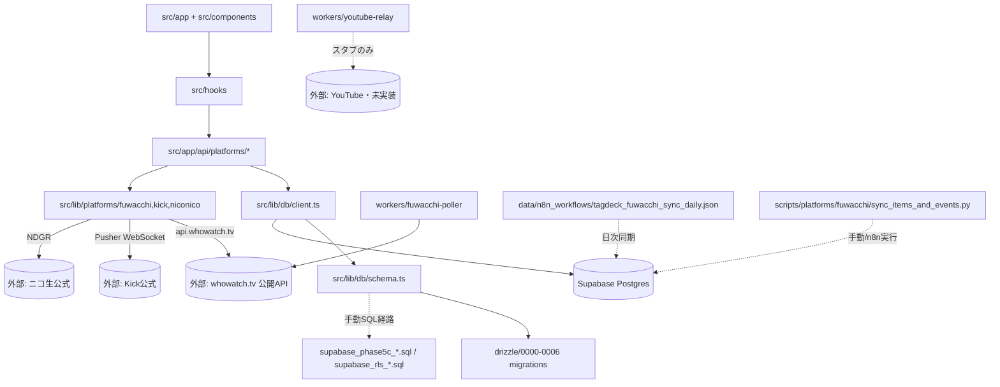

# TagDeck 棚卸しレポート v1 (2026-07-18)

> 作成: Claude Code（TagTech / モデル Fable 5・社長明示指示によるモデル選択原則 v1.0 原則2 例外・本セッション記述が承認証跡）
> 対象コミット: `0041579`（本セッションの保全 commit、`main` 上）／作業ブランチ: `feat/tagdeck-spec-impl-20260718`
> 位置付け: 既存棚卸し `docs/inventory_20260510.md`（2026-05-10）・`docs/migration/tagdeck_inventory_20260511.md`（2026-05-11）を継承・更新する最新版。旧2件の内容と矛盾する場合は本ファイル（実地確認済み）を正とする。

---

## 0. 本セッション冒頭の環境整理（記録）

作業ブランチ作成前に以下を検出・社長承認のうえ処理済み（詳細は本セッションの会話ログ参照）:

| 項目 | 内容 | 処理 |
|---|---|---|
| 未コミット変更2件 | `CLAUDE.md`（CODEX_CLAUDE.md 参照追加）/ `MonitorControlCard.tsx`（`{platformName}:{statusLabel}` 表示） | `CODEX_CLAUDE.md` 新規と併せて commit `0041579` で保全（author: Claude Code (TagTech)） |
| 断片ファイル2件 | `0)console.log(x[0]` / `{for(const`（いずれも0バイト・2026-05-26作成・シェル誤生成と推定） | 社長承認のうえ削除 |
| Drizzle journal backup 2件 | `_journal.json.backup_20260522` / `_journal.json.backup_20260526` | 削除・追跡せず維持（本レポート §3 で比較材料として利用） |
| 先行未pushコミット | `ce0c880`（author: 社長本人、`improve-platform-monitor-controls`） | 変更せず・push もしない |

---

## 1. メタ情報

| 項目 | 値 |
|---|---|
| リポジトリ | D:\tagdeck |
| origin | https://github.com/nikkun22/tagdeck.git |
| デフォルトブランチ | main |
| 作業ブランチ | feat/tagdeck-spec-impl-20260718 |
| package.json name/version | tagdeck / 0.1.0 |
| フレームワーク | Next.js 16.2.4 / React 19.2.4 |
| デプロイ先 | Cloudflare Workers（OpenNext 経由）/ 本番 tagdeck.jp |
| DB | Supabase Postgres（Drizzle ORM 0.45.2 / drizzle-kit 0.31.10） |
| パッケージマネージャ | pnpm |

---

## 2. 技術スタックサマリー（package.json 由来）

### 主要 dependencies
Next.js 16.2.4 / React 19.2.4 / drizzle-orm 0.45.2 / postgres 3.4.9 / @supabase/ssr 0.10.2 / @supabase/supabase-js 2.105.3 / @tanstack/react-query 5.100.9 / zustand 5.0.13 / zod 4.4.3 / recharts 3.8.1 / framer-motion 12.38.0 / pusher-js 8.5.0 / react-hook-form 7.75.0 / @base-ui/react 1.4.1（shadcn base-nova 系）/ @serwist/next 9.5.11（PWA）

### 主要 devDependencies
drizzle-kit 0.31.10 / @opennextjs/cloudflare 1.19.6 / wrangler 4.88.0 / vitest 4.1.5 / typescript 5 / tailwindcss 4 / @cloudflare/workers-types 4.20260506.1

### npm scripts
`dev`（turbopack）/ `build`（webpack）/ `start` / `lint` / `preview`・`deploy`（opennextjs-cloudflare）/ `db:generate`・`db:migrate`・`db:studio`（drizzle-kit）/ `test`・`test:watch`（vitest）

---

## 3. ディレクトリ構造（抜粋・深さ4）

```
D:/tagdeck/
├── AGENTS.md / CLAUDE.md / CODEX_CLAUDE.md / README.md（未編集の create-next-app 既定文言のまま・要確認）
├── src/
│   ├── app/
│   │   ├── (auth)/{login,signup,reset-password}
│   │   ├── (dashboard)/{dashboard,events,crm,ai-prompter,settings}
│   │   ├── (legal)/{privacy,terms}
│   │   ├── api/{events,listeners,platforms/{fuwacchi,kick,niconico}}
│   │   └── auth/{callback,confirm,signout}
│   ├── components/{auth,crm,dashboard,events,layout,nav,settings,shared,stats,ui}
│   ├── hooks/（8ファイル）
│   ├── lib/{db,events,mock,platforms/{fuwacchi,kick,niconico},supabase,validations}
│   ├── stores/（zustand: crm-filter-store, platform-store）
│   ├── types/{listener,platform,stats}.ts
│   └── middleware.ts, sw.ts
├── workers/
│   ├── fuwacchi-poller/（実装あり・dist/index.js ビルド済み）
│   ├── youtube-relay/（index.ts 26行・最小スタブ）
│   ├── kick-watcher/（空ディレクトリ・git履歴0件）
│   └── niconico-watcher/（空ディレクトリ・git履歴0件）
├── scripts/platforms/fuwacchi/（Python: sync_items_and_events.py + pytest）
├── data/n8n_workflows/tagdeck_fuwacchi_sync_daily.json
├── drizzle/（0000〜0006 の7 migration + meta/）
├── docs/{architecture,decisions,features,investigation,legal,migration,retrospectives,inventory_20260510.md}
├── logs/fuwacchi_sync_*.log（48ファイル・2026-05-09〜2026-07-06）
├── supabase_*.sql（root直下6ファイル・Drizzle管理外の手動SQL）
└── _build_baseline_20260512.txt 等のビルドログ4種（root直下・要確認: 一時ファイルの可能性）
```

---

## 4. 機能マップ

### ページ一覧（13ページ）
`/`（page.tsx）、`(auth)`: login / signup / reset-password、`(dashboard)`: dashboard / events / crm / ai-prompter / settings / settings/notifications / settings/platforms、`(legal)`: privacy / terms

### API エンドポイント一覧（17ルート）
- `events`: `GET/POST /api/events`、`/api/events/[id]/{refresh-ranking,manual-rivals,historical-pace,complete}`
- `listeners`: `/api/listeners`
- `platforms/fuwacchi`: `monitor` / `items` / `events` / `poll` / `profile`
- `platforms/kick`: `monitor` / `profile` / `event`
- `platforms/niconico`: `monitor` / `poll` / `profile`
- YouTube 専用 API ルートなし（`auth/callback` は OAuth 共通経路）

### カスタムフック（8件）
`useDashboardListeners` / `useDashboardPlatforms` / `useEventSimulator` / `useFuwacchiMonitor` / `useHistoricalPace` / `useKickMonitor` / `useNiconicoMonitor` / `useResponsive`

### テスト（Vitest 5件 + pytest 1件）
- `src/lib/events/bayesian.test.ts`
- `src/lib/platforms/fuwacchi.test.ts`
- `src/lib/platforms/fuwacchi/event-list.test.ts`
- `src/lib/platforms/fuwacchi/item-mapping.test.ts`
- `src/lib/platforms/niconico.test.ts`
- `scripts/platforms/fuwacchi/test_sync_items_and_events.py`（Python側）
- kick.ts に対応する `.test.ts` は存在しない（(要確認)）
- 本セッションでは npm test / pytest の実行はしていない（Step 0 は read-only 方針のため。実行結果は未検証）

---

## 5. プラットフォーム対応状況（実装済み/実装中/未実装の一次判定・詳細は仕様書 v1 §3 で確定）

| プラットフォーム | UI/hooks | API route | DB専用カラム | Worker | 判定（一次） |
|---|---|---|---|---|---|
| ふわっち (whowatch.tv) | ✅ FuwacchiSettings / useFuwacchiMonitor | ✅ 5ルート | ✅ streamer_profiles.fuwacchi_* 8列 + fuwacchi_events テーブル | ✅ fuwacchi-poller（ビルド済み） | 実装済み（最多機能） |
| Kick | ✅ KickMonitorButton / useKickMonitor | ✅ 3ルート | ✅ streamer_profiles.kick_* 7列 | ⚠️ kick-watcher 空ディレクトリ（未実装・API route側で完結の可能性・要確認） | 実装済み |
| ニコ生 | ✅ NiconicoSettings / useNiconicoMonitor | ✅ 3ルート | ✅ streamer_profiles.niconico_* 10列 | ⚠️ niconico-watcher 空ディレクトリ（要確認） | 実装済み（Phase 4c MVP） |
| YouTube Live | ❌ UI/hooks/型定義なし | ❌ 専用ルートなし | ✅ youtube_oauth_tokens テーブルのみ（0005で追加） | ⚠️ youtube-relay 26行スタブ | 未実装（OAuth基盤のみ先行） |

`src/types/platform.ts` の `Platform` 型union は `"fuwacchi" | "kick" | "niconico"` の3値のみで YouTube 未包含。

---

## 6. Drizzle 精査（Step 0-6）

### 6-1. journal 現況（`drizzle/meta/_journal.json`）

現行 journal は **idx 0〜6（7件）が登録済み**で `drizzle/0000〜0006` の7 migration ファイルと一致。バックアップとの比較で登録の時系列を確認:

| ファイル | 内容 | 対応するタイミング |
|---|---|---|
| `_journal.json.backup_20260522` | idx 0〜3のみ | 0004/0005 登録前 |
| `_journal.json.backup_20260526` | idx 0〜5 | 0006 登録前 |
| `_journal.json`（現行） | idx 0〜6 全件 | 現在（0006まで登録済み） |

登録コミットは git log で実在確認済み: `83f0531`「chore(drizzle): register migrations 0004/0005 in journal」/ `e51d5c4`「chore(db): register 0006_fuwacchi_event_id in drizzle journal」。**journal 自体の未記載問題は解消済み**（STATUS.md §5 の「Drizzle 0004/0005 journal 未記載問題」の journal 部分は既に解決済みと判断・要社長確認）。

### 6-2. 未解消の残課題: snapshot JSON 欠落

`drizzle/meta/` 配下に **`0000_snapshot.json`〜`0003_snapshot.json` の4件のみ存在**。0004/0005/0006 に対応する snapshot JSON が存在しない。

既存の決定文書 `docs/decisions/drizzle_snapshot_reconcile_postponed_20260526.md`（v1.0・社長承認済み）によれば:
- 原因: drizzle-kit 0.31.10 の check constraint バグ（`TypeError: Cannot read properties of undefined (reading 'replace')`）で `pull` がクラッシュ（案α）。修正版は 1.0.0-beta.12 以降だが本稿執筆時点 1.0.0 は未 stable リリース（rc.4 止まり）
- 検討済み代替案（β: generate再構築／γ: 手動構築／ε: FK修正+β）はいずれもリスクまたはスコープ超過で却下
- **採択: 案δ（現状維持）** — 日常運用に影響なし、次回 migration 追加時のみ顕在化、drizzle-kit 1.0 stable リリース後に pull で補完予定
- package.json 記載の drizzle-kit バージョンは本稿時点でも `^0.31.10` のまま（決定文書時点から変化なし・要確認: 1.0 stable の最新リリース状況）

### 6-3. テーブル差分（Drizzle管理 vs 手動SQL管理）

`schema.ts` の9テーブルのうち、実際の生成経路が2系統に分かれている:

| テーブル | schema.ts定義 | 生成元 | Drizzle migration追跡 |
|---|---|---|---|
| users, streamer_profiles, listeners, events, event_simulators, event_history | ✅ | drizzle 0000〜0004 | ✅ 追跡あり |
| youtube_oauth_tokens | ✅ | drizzle 0005 | ✅ 追跡あり |
| item_point_mapping | ✅ | **root直下 `supabase_phase5c_item_mapping.sql`（手動実行）+ `supabase_phase5c_extension.sql`（カラム追加）** | ❌ drizzle migration非経由 |
| fuwacchi_events | ✅ | **root直下 `supabase_phase5c_extension.sql`（手動実行）**、0006はFK列追加のみ | ❌ テーブル本体はdrizzle migration非経由（0006はevent_simulators側のFK列追加のみ担当） |

root直下には他に `supabase_rls_phase4a.sql` / `supabase_rls_phase5.sql`（+rollback）もあり、RLS（行レベルセキュリティ）ポリシーも同様にDrizzle管理外。これらは全て「社長が Supabase SQL Editor で手動実行」を前提としたスクリプト（各ファイル冒頭コメントに明記）。

**構造的リスク**: schema.ts が2種類の生成経路（drizzle-kit generate 由来 / 手動SQL）を区別なく1ファイルに混在させているため、`drizzle-kit generate` を今後実行すると手動SQL側のテーブル・カラム・RLSポリシーを「差分」として誤検知し、意図しない DROP/ALTER が生成されるおそれがある（要確認・実地未検証）。

---

## 7. fuwacchi 表記残存状況（Step 0-7・whowatch統一の母数確定）

| 種類 | 件数 | 主な所在 |
|---|---|---|
| ファイル名・ディレクトリ名 | 58件（ログ48件含む） | `src/lib/platforms/fuwacchi*`、`src/app/api/platforms/fuwacchi/`、`workers/fuwacchi-poller/`、`scripts/platforms/fuwacchi/`、`logs/fuwacchi_sync_*.log`（48件） |
| `src/` 内識別子・文字列（大小文字区別なし） | 332件 / 31ファイル | 型（`Platform = "fuwacchi"`）、DB列（`fuwacchi_user_id` 等8列 + `fuwacchi_event_id`）、コンポーネント名（`FuwacchiSettings`）、フック名（`useFuwacchiMonitor`）等 |
| `workers/` 内（node_modules除く） | 68件 / 8ファイル | `fuwacchi-poller/index.ts` 中心 |
| 環境変数名 | 1種類（`FUWACCHI_DEVICE_ID`） | `src/lib/platforms/fuwacchi.ts` 等7ファイルで参照。CI/CD文書（`docs/architecture/ci_cd_v1.md`）にも Cloudflare Secret名として記載 |
| DBカラム/テーブル名 | `streamer_profiles.fuwacchi_*` 8列 + `event_simulators.fuwacchi_event_id` + `fuwacchi_events` テーブル本体 | schema.ts 該当箇所 §6-3 参照 |
| docs/ 内言及 | 138件 / 19ファイル | 設計書・移行計画・法務調査等 |

**対比**: 外部API・ブランドの実名は既に `whowatch`（`api.whowatch.tv` / `whowatch.tv` / HTTPヘッダ `x-whowatch-device-id`）としてコード中に34箇所以上登場している（`src/lib/platforms/fuwacchi.ts`, `fuwacchi-ranking.ts`, `fuwacchi/event-list.ts`, テストファイル等）。**現状は「外部実名=whowatch」「内部識別子=fuwacchi（日本語カタカナ「ふわっち」のローマ字）」が混在**しており、これが whowatch 統一タスク（Step 3 P2〜P4）の対象母数。UI表示ラベル（`PLATFORM_LABELS.fuwacchi = "ふわっち"`）は日本語のままで変更対象外と推定（要確認・仕様書§8で確定事項化）。

---

## 8. 法務適合性（既存調査の要約・参照のみ）

`docs/legal/scraping-compliance-2026-05-09.md`（v1.1・社長承認済み）:
- ふわっち・ニコ生とも robots.txt/利用規約とも「明示的スクレイピング禁止なし・曖昧」判定 (b)
- 条件付き Go: アクセス間隔（ふわっち25秒以上・ニコ生30秒以上）、User-Agent固定（`TagDeck/0.1 (+https://tagdeck.jp)`）、Disallowパス回避、イベント期間外自動停止等6条件遵守が前提
- AGENTS.md 側の運用ルール「ふわっちは公開API（api.whowatch.tv/lives2等）のポーリングのみ・非公式WebSocket禁止」と整合
- STATUS.md §5 に「ふわっち api.whowatch.tv / ranking ページの規約適合性確認」が中優先タスクとして未完扱いで残存 — 本レポート§8の内容と齟齬があるため要社長確認（法務調査自体は2026-05-09完了済みだが、継続監視項目「月1回robots.txt変更確認」が未運用の可能性）

---

## 9. CI/CD（既存文書の参照）

`docs/architecture/ci_cd_v1.md`（2026-05-22・CTO+インフラ部長作成）: `.github/workflows/deploy.yml` が main push を検知し pnpm install → tsc --noEmit → vitest → opennextjs-cloudflare build → wrangler deploy の順で自動実行、型チェック/テスト失敗時は fail-fast。Cloudflare Secrets に `FUWACCHI_DEVICE_ID` 含む4件。

---

## 10. 依存関係マップ（Mermaid）



---

## 11. (要確認) 一覧（本レポート内で推測に留まった項目）

1. `kick-watcher` / `niconico-watcher` が空ディレクトリである理由（設計上API route側で完結し不要になったのか、単に未着手か）
2. `README.md` が create-next-app 既定文言のまま未編集である扱い（意図的放置か、単純な見落としか）
3. root直下 `_build_baseline_20260512.txt` 等4ビルドログファイルの要否（一時ファイルの可能性・`.gitignore` 対象化候補）
4. drizzle-kit 1.0.0 の stable リリース状況（本セッションはオフライン調査のため npm registry 未確認）
5. `schema.ts generate` 実行時に手動SQL管理テーブル（fuwacchi_events / item_point_mapping / RLS）が誤検知される具体的挙動（実地未検証）
6. STATUS.md §5「ふわっち規約適合性確認」未完了マークと、`docs/legal/scraping-compliance-2026-05-09.md` 完了済み内容との齟齬の真因
7. whowatch統一の対象範囲（UI表示ラベル「ふわっち」は据え置きか、内部識別子のみ対象か）→ 仕様書v1 §7で用語統一方針として確定事項化する
