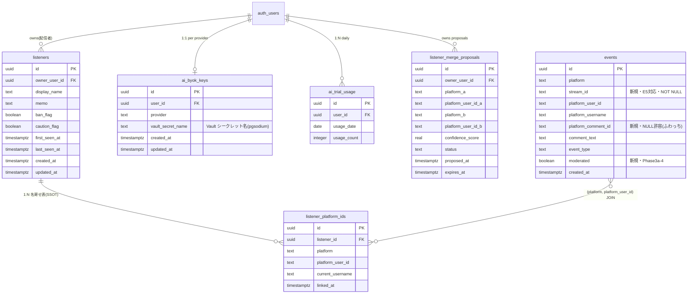

# TagDeck Phase 3 DB 設計案 v0.2(Vault 採択・BYOK C3 対応済み)

> **起案日**: 2026-05-11
> **起案者**: claude.ai 上の Claude(社長補助)
> **最終更新**: Claude Code — L2-4 修正 stream_id 整合性訂正(v0.1 → v0.2)
> **入力資料**: phase3_plan_v0.3.md / ext_audit_response_phase3_v0.3.md / DB 要件抽出結果 / E5 mini-task 調査結果 / BYOK 3案比較(α採択)
> **採択前提(社長確定済み)**: E1 = C案(SSOT 分離・listener_platform_ids が真実の源)
> **状態**: v0.2・Vault 採択確定・社長承認待ち
> **次工程**: T3.1〜T3.5 実機検証 → v0.4 反映プロンプト → Claude Code が phase3_plan_v0.4.md 生成

---

## 1. 設計上の重要発見(E5 調査結果ベース)

### 1.1 PF 別冪等性キーの非対称性

| PF | キー有無 | 設計上の含意 |
|---|---|---|
| Kick | ○(UUID) | `(platform, platform_comment_id)` UNIQUE で十分 |
| Twitch | ○(UUID) | 同上(最も信頼度が高い・公式仕様) |
| YouTube | ○(YouTube ID) | 同上(削除後 tombstone 残存) |
| ニコ生 | △ | `(platform, stream_id, platform_comment_id)` の **3カラム複合 UNIQUE** が必要 |
| ふわっち | × | `platform_comment_id` **NULL 許容** + アプリ層 dedup 必須 |

### 1.2 events テーブルへの追加カラム3つ

E1=C案により `listener_id` FK は追加せず、E5 結果により以下3カラムを追加:

| カラム | 型 | NULL | 用途 |
|---|---|---|---|
| `stream_id` | text | NOT NULL(段階移行・§10 参照) | ニコ生(thread_id 相当)・他PFは配信回識別子 |
| `platform_comment_id` | text | NULL 許容 | ふわっちのみ NULL・他は冪等性キー |
| `moderated` | boolean | NOT NULL DEFAULT false | Phase 3a-4 で Llama Guard 結果格納 |

---

## 2. ER 図(全6エンティティ・Mermaid)



---

## 3. Postgres DDL(完全版)

### 3.1 events 既存テーブル拡張

```sql
-- E1=C案により listener_id FK は追加しない
-- E5 結果により以下3カラム追加

ALTER TABLE events
  ADD COLUMN IF NOT EXISTS stream_id text,
  ADD COLUMN IF NOT EXISTS platform_comment_id text,
  ADD COLUMN IF NOT EXISTS moderated boolean NOT NULL DEFAULT false;

-- バックフィル戦略(既存レコードに stream_id を入れる方法)は §10 参照(段階移行)
-- 当面は ALTER 直後 stream_id NULL 許容 → バックフィル完了後 NOT NULL 化
```

### 3.2 events 部分 UNIQUE インデックス(E5 対応)

```sql
-- ニコ生以外: (platform, platform_comment_id) UNIQUE
-- platform_comment_id NULL のレコード(ふわっち)は対象外
CREATE UNIQUE INDEX IF NOT EXISTS uq_events_pcid_non_niconico
  ON events (platform, platform_comment_id)
  WHERE platform_comment_id IS NOT NULL AND platform <> 'niconico';

-- ニコ生のみ: (platform, stream_id, platform_comment_id) 3カラム複合 UNIQUE
CREATE UNIQUE INDEX IF NOT EXISTS uq_events_niconico_stream_pcid
  ON events (platform, stream_id, platform_comment_id)
  WHERE platform = 'niconico'
    AND stream_id IS NOT NULL
    AND platform_comment_id IS NOT NULL;
```

### 3.3 events インデックス(E1=C案 JOIN 高速化)

```sql
-- listener_platform_ids との結合用
CREATE INDEX IF NOT EXISTS idx_events_platform_user
  ON events (platform, platform_user_id);

-- 時系列クエリ用(配信ごとの行動履歴・§11.2)
CREATE INDEX IF NOT EXISTS idx_events_created_at
  ON events (created_at DESC);

-- 配信ごと集計用(stream_id でフィルタ)
CREATE INDEX IF NOT EXISTS idx_events_stream
  ON events (stream_id, created_at DESC)
  WHERE stream_id IS NOT NULL;
```

### 3.4 listeners(新規)

```sql
CREATE TABLE listeners (
    id              uuid PRIMARY KEY DEFAULT gen_random_uuid(),
    owner_user_id   uuid NOT NULL REFERENCES auth.users(id) ON DELETE CASCADE,
    display_name    text NOT NULL,
    memo            text NOT NULL DEFAULT '',
    ban_flag        boolean NOT NULL DEFAULT false,
    caution_flag    boolean NOT NULL DEFAULT false,
    first_seen_at   timestamptz,
    last_seen_at    timestamptz,
    created_at      timestamptz NOT NULL DEFAULT now(),
    updated_at      timestamptz NOT NULL DEFAULT now()
);

CREATE INDEX idx_listeners_owner ON listeners (owner_user_id);

-- 計画書 §11.2「タグ付き・全文検索対応」のためのGINインデックス
CREATE INDEX idx_listeners_memo_fts
  ON listeners USING gin (to_tsvector('simple', memo));

-- updated_at 自動更新トリガー
CREATE OR REPLACE FUNCTION trigger_set_updated_at()
RETURNS TRIGGER AS $$
BEGIN
  NEW.updated_at = now();
  RETURN NEW;
END;
$$ LANGUAGE plpgsql;

CREATE TRIGGER set_listeners_updated_at
  BEFORE UPDATE ON listeners
  FOR EACH ROW EXECUTE FUNCTION trigger_set_updated_at();
```

### 3.5 listener_platform_ids(新規・SSOT)

```sql
CREATE TABLE listener_platform_ids (
    id                uuid PRIMARY KEY DEFAULT gen_random_uuid(),
    listener_id       uuid NOT NULL REFERENCES listeners(id) ON DELETE CASCADE,
    platform          text NOT NULL,
    platform_user_id  text NOT NULL,
    current_username  text,
    linked_at         timestamptz NOT NULL DEFAULT now(),
    -- 同一PF×ユーザーは1人のリスナーにのみ紐付く(名寄せの一意性保証)
    UNIQUE (platform, platform_user_id)
);

CREATE INDEX idx_lpi_listener ON listener_platform_ids (listener_id);
-- events からの逆引き高速化(events JOIN の主要用途)
CREATE INDEX idx_lpi_lookup
  ON listener_platform_ids (platform, platform_user_id);
```

### 3.6 listener_merge_proposals(新規)

```sql
CREATE TABLE listener_merge_proposals (
    id                   uuid PRIMARY KEY DEFAULT gen_random_uuid(),
    owner_user_id        uuid NOT NULL REFERENCES auth.users(id) ON DELETE CASCADE,
    platform_a           text NOT NULL,
    platform_user_id_a   text NOT NULL,
    platform_b           text NOT NULL,
    platform_user_id_b   text NOT NULL,
    confidence_score     real NOT NULL CHECK (confidence_score BETWEEN 0 AND 1),
    status               text NOT NULL DEFAULT 'pending'
        CHECK (status IN ('pending','accepted','rejected','expired')),
    proposed_at          timestamptz NOT NULL DEFAULT now(),
    expires_at           timestamptz NOT NULL DEFAULT (now() + interval '30 days')
);

CREATE INDEX idx_lmp_owner_status ON listener_merge_proposals (owner_user_id, status);
CREATE INDEX idx_lmp_expires_pending
  ON listener_merge_proposals (expires_at)
  WHERE status = 'pending';
```

### 3.7 ai_byok_keys(新規・Vault 採択版)

```sql
-- v0.1 変更点: encrypted_api_key(bytea) → vault_secret_name(text)
-- Supabase Vault(pgsodium)採択により API キー実体は vault.secrets に格納
-- key_id カラム廃止(ローテーションは UPSERT で対応・E3)

CREATE TABLE ai_byok_keys (
    id                  uuid PRIMARY KEY DEFAULT gen_random_uuid(),
    user_id             uuid NOT NULL REFERENCES auth.users(id) ON DELETE CASCADE,
    provider            text NOT NULL CHECK (provider IN ('groq')),  -- E10で拡張
    vault_secret_name   text NOT NULL UNIQUE,  -- 命名規則: 'groq_key_' || user_id::text
    created_at          timestamptz NOT NULL DEFAULT now(),
    updated_at          timestamptz NOT NULL DEFAULT now(),
    -- 1ユーザー×1プロバイダーで1鍵
    UNIQUE (user_id, provider)
);

CREATE INDEX idx_byok_user ON ai_byok_keys (user_id);

CREATE TRIGGER set_byok_updated_at
  BEFORE UPDATE ON ai_byok_keys
  FOR EACH ROW EXECUTE FUNCTION trigger_set_updated_at();
```

### 3.8 ai_trial_usage(新規)

```sql
CREATE TABLE ai_trial_usage (
    id            uuid PRIMARY KEY DEFAULT gen_random_uuid(),
    user_id       uuid NOT NULL REFERENCES auth.users(id) ON DELETE CASCADE,
    usage_date    date NOT NULL,
    usage_count   integer NOT NULL DEFAULT 0 CHECK (usage_count >= 0),
    UNIQUE (user_id, usage_date)
);

CREATE INDEX idx_trial_usage_lookup ON ai_trial_usage (user_id, usage_date);

-- UPSERT パターン(Phase 3a-4 で利用)
-- INSERT INTO ai_trial_usage (user_id, usage_date, usage_count)
-- VALUES (?, CURRENT_DATE, 1)
-- ON CONFLICT (user_id, usage_date)
-- DO UPDATE SET usage_count = ai_trial_usage.usage_count + 1
-- RETURNING usage_count;
```

---

## 4. RLS(Row Level Security)ポリシー骨子

Supabase 標準パターン: 全テーブルで「自分のデータのみ」アクセス可。

```sql
-- ===== listeners =====
ALTER TABLE listeners ENABLE ROW LEVEL SECURITY;

CREATE POLICY listeners_owner_all ON listeners
    FOR ALL TO authenticated
    USING (owner_user_id = auth.uid())
    WITH CHECK (owner_user_id = auth.uid());

-- ===== listener_platform_ids(listener 経由で間接認可) =====
ALTER TABLE listener_platform_ids ENABLE ROW LEVEL SECURITY;

CREATE POLICY lpi_via_listener ON listener_platform_ids
    FOR ALL TO authenticated
    USING (
        EXISTS (
            SELECT 1 FROM listeners
            WHERE listeners.id = listener_platform_ids.listener_id
              AND listeners.owner_user_id = auth.uid()
        )
    )
    WITH CHECK (
        EXISTS (
            SELECT 1 FROM listeners
            WHERE listeners.id = listener_platform_ids.listener_id
              AND listeners.owner_user_id = auth.uid()
        )
    );

-- ===== listener_merge_proposals =====
ALTER TABLE listener_merge_proposals ENABLE ROW LEVEL SECURITY;

CREATE POLICY lmp_owner_all ON listener_merge_proposals
    FOR ALL TO authenticated
    USING (owner_user_id = auth.uid())
    WITH CHECK (owner_user_id = auth.uid());

-- ===== ai_byok_keys =====
ALTER TABLE ai_byok_keys ENABLE ROW LEVEL SECURITY;

CREATE POLICY byok_owner_all ON ai_byok_keys
    FOR ALL TO authenticated
    USING (user_id = auth.uid())
    WITH CHECK (user_id = auth.uid());

-- ===== ai_trial_usage =====
ALTER TABLE ai_trial_usage ENABLE ROW LEVEL SECURITY;

CREATE POLICY trial_usage_owner_all ON ai_trial_usage
    FOR ALL TO authenticated
    USING (user_id = auth.uid())
    WITH CHECK (user_id = auth.uid());

-- ===== events =====
-- 既存の events テーブルに RLS が設定されているかは Phase 0 棚卸しで未確認
-- 設定がない場合は owner_user_id ベースで設定する必要あり
-- (events に owner_user_id が存在するか・要確認 → §9 T3.5)
```

### 4.1 サービスロール経由の書き込み

Render Worker(ふわっち・YouTube)からの events INSERT は **service_role** キー経由で RLS をバイパス。Render の環境変数管理は §11.5 の「Render Free Worker 認証情報」と一貫。

### 4.2 Vault アクセス制御(SECURITY DEFINER ラッパー)

Supabase Vault は `vault.secrets` テーブルへの直接アクセスが標準 RLS をバイパスする。
SECURITY DEFINER + auth.uid() チェックのラッパー関数で一意制御する。

```sql
-- Vault スキーマへの直接アクセスを全ロールから禁止
REVOKE ALL ON SCHEMA vault FROM PUBLIC, authenticated, anon;

-- Groq API キー取得(認証済みユーザーは自分のキーのみ)
CREATE OR REPLACE FUNCTION get_my_groq_key()
RETURNS text
LANGUAGE plpgsql
SECURITY DEFINER
SET search_path = vault, public
AS $$
DECLARE
  v_secret_name text;
  v_secret_value text;
BEGIN
  SELECT vault_secret_name INTO v_secret_name
  FROM public.ai_byok_keys
  WHERE user_id = auth.uid()
    AND provider = 'groq';

  IF v_secret_name IS NULL THEN
    RETURN NULL;
  END IF;

  SELECT decrypted_secret INTO v_secret_value
  FROM vault.decrypted_secrets
  WHERE name = v_secret_name;

  RETURN v_secret_value;
END;
$$;

GRANT EXECUTE ON FUNCTION get_my_groq_key() TO authenticated;

-- Groq API キー登録/更新
CREATE OR REPLACE FUNCTION set_my_groq_key(p_api_key text)
RETURNS void
LANGUAGE plpgsql
SECURITY DEFINER
SET search_path = vault, public
AS $$
DECLARE
  v_secret_name text;
BEGIN
  v_secret_name := 'groq_key_' || auth.uid()::text;

  IF EXISTS (SELECT 1 FROM vault.secrets WHERE name = v_secret_name) THEN
    UPDATE vault.secrets SET secret = p_api_key WHERE name = v_secret_name;
  ELSE
    INSERT INTO vault.secrets (name, secret) VALUES (v_secret_name, p_api_key);
  END IF;

  INSERT INTO public.ai_byok_keys (user_id, provider, vault_secret_name)
  VALUES (auth.uid(), 'groq', v_secret_name)
  ON CONFLICT (user_id, provider) DO UPDATE SET updated_at = now();
END;
$$;

GRANT EXECUTE ON FUNCTION set_my_groq_key(text) TO authenticated;

-- Groq API キー削除(物理削除・E2=A案採択)
CREATE OR REPLACE FUNCTION delete_my_groq_key()
RETURNS void
LANGUAGE plpgsql
SECURITY DEFINER
SET search_path = vault, public
AS $$
DECLARE
  v_secret_name text;
BEGIN
  SELECT vault_secret_name INTO v_secret_name
  FROM public.ai_byok_keys
  WHERE user_id = auth.uid()
    AND provider = 'groq';

  IF v_secret_name IS NOT NULL THEN
    DELETE FROM vault.secrets WHERE name = v_secret_name;
    DELETE FROM public.ai_byok_keys WHERE user_id = auth.uid() AND provider = 'groq';
  END IF;
END;
$$;

GRANT EXECUTE ON FUNCTION delete_my_groq_key() TO authenticated;
```

> **注意**: `vault.decrypted_secrets` ビューは pgsodium 鍵管理に依存するが、Vault API(上記ラッパー関数インターフェース)は pgsodium 非推奨化の影響を受けない。実機での動作確認は T3.1 で実施。

---

## 5. E2〜E10 判断軸(採択確定版)

各論点について **A/B/C 案 + 推奨 + 採択** を提示。

### E2: BYOK 削除フロー

| 案 | 内容 | 推奨 | 採択 |
|---|---|---|---|
| A | 物理削除(DELETE) | **○ 推奨** — 機密情報を残す理由なし・GDPR 配慮 | ✓ |
| B | 論理削除(deleted_at) | × — BYOK 鍵に履歴管理は不要 | |

### E3: BYOK ローテーション

| 案 | 内容 | 推奨 | 採択 |
|---|---|---|---|
| A | UPSERT で上書き(履歴なし) | **○ 推奨** — シンプル・MVP に十分 | ✓ |
| B | history テーブル別途 | × — 過剰設計 | |
| 補助 | audit_log に「鍵更新イベント」のみ記録(値は記録しない) | 別タスクで CISO 連動 | |

### E4: AI 接客カンペ生成結果 永続化

| 案 | 内容 | 推奨 | 採択 |
|---|---|---|---|
| A | 永続化しない(揮発・UI のみ) | **○ 推奨** — MVP・履歴機能は計画書記述なし | ✓ |
| B | ai_advice_history テーブル追加 | × — 過剰設計(Phase 4 以降の検討) | |

### E5: → 解決済み(冪等性キー設計)

E5 mini-task の結果を §1・§3.2 に反映済み。

### E6: listener_merge_proposals の有効期限

| 案 | 内容 | 推奨 | 採択 |
|---|---|---|---|
| A | 30日後 status='expired' に自動更新 | **○ 推奨** — 後で振り返れる・サマリー集計に使える | ✓ |
| B | 30日後物理削除 | △ — 単純だが履歴を失う | |
| 補助 | n8n 日次ワークフローで `UPDATE ... SET status='expired' WHERE expires_at < now() AND status='pending'` | 実装時に Phase 3a-5 で追加 | |

### E7: 投げ銭累計・コメント頻度の集計方法

| 案 | 内容 | 推奨 | 採択 |
|---|---|---|---|
| A | events から都度 SQL 集計 | **○ 推奨** — MVP で十分・配信者100人想定 | ✓ |
| B | マテリアライズドビュー | △ — リフレッシュ運用が増える | |
| C | 集計テーブル(日次バッチ) | × — Phase 3 では不要 | |
| 補助 | 性能課題が出たら C → B → MV CONCURRENTLY に切替 | 余地として残す | |

### E8: 配信セッション(stream_id)の DB 表現

| 案 | 内容 | 推奨 | 採択 |
|---|---|---|---|
| A | events.stream_id をテキストで保持(streams テーブルなし) | **○ 推奨** — E5 対応に最低限・MVP | ✓ |
| B | streams テーブル新規作成・FK | × — Phase 4 以降に検討余地 | |

### E9: moderated 変更履歴

| 案 | 内容 | 推奨 | 採択 |
|---|---|---|---|
| A | 履歴なし(events.moderated を直接 UPDATE) | **○ 推奨** — モデレーション設定は audit log で十分 | ✓ |
| B | events_audit テーブル追加 | × — 過剰設計 | |

### E10: Groq 以外プロバイダー対応

| 案 | 内容 | 推奨 | 採択 |
|---|---|---|---|
| A | provider カラム CHECK で 'groq' 限定・将来 ALTER で拡張 | **○ 推奨** — 拡張余地確保・MVP は Groq のみ | ✓ |
| B | provider カラムなし(groq 固定) | × — 拡張時に ALTER + データ移行 | |

---

## 6. M1 / M2 矛盾の v0.4 内での解消方針

### M1: §7.2 と §10.4 の実装許可範囲の矛盾

**v0.4 解消方針**:
- §7.2 行221「非公式 WS 調査を並行実施」を以下に置換:
  > 「非公式 WS の **ドキュメント・第三者実装の確認(調査)** を並行実施する。**実装着手は §10.4 の CISO+CLO 合議承認後**に限る。」
- §7.2 と §10.4 に相互参照を追加:
  - §7.2 末尾: 「→ 実装許可範囲の詳細は §10.4 を参照」
  - §10.4 冒頭: 「← §7.2 の作業範囲を以下のゲート設計で制約する」

### M2: §9 R4 フォールバック先が §7.4 作業内容に未記述

**v0.4 解消方針**:
- §7.4 成果物リスト末尾に以下を追記:
  > 「**Phase 3a-4 では Groq クライアントのみ実装**。§9 R4 で言及される Gemini Free / Claude Haiku へのフォールバックは **将来対策の予告であり、本フェーズのスコープ外**。」
- §9 R4 を「Phase 3a-4 完了後に評価する将来対策」と明示。

---

## 7. BYOK 暗号化方式の採択決定(α = Supabase Vault)

### 7.1 採択: α案 Supabase Vault

| 観点 | 評価 |
|---|---|
| 鍵管理の安全性 | Supabase 管理のルートキー・TagTech .env 依存ゼロ |
| Free Tier 利用可否 | **利用可能**(pgsodium は Free 含む全プランで有効) |
| 実装複雑度 | 中(SECURITY DEFINER ラッパー関数3本が必要) |
| .env 漏洩リスク | **最小**: ルートキーは .env に存在しない |
| TagTech 履歴との整合 | .env 漏洩4回の実績を踏まえ **最適選択** |

### 7.2 却下: β案 pgcrypto

**却下理由**: マスターパスフレーズを .env に保持する必要あり。TagTech は過去4回 .env 漏洩実績があり、パスフレーズが平文で DB サーバーを通過する点が許容不可。pgcrypto 関数呼び出し時に passphrase 引数が SQL ステートメントログに残るリスクも問題。

### 7.3 却下: γ案 アプリ層 AES-GCM

**却下理由**: マスター鍵を .env に保持する点は β案と同様のリスク。Render Free Worker 再起動時の in-memory 鍵共有も問題。複数 Worker インスタンスへの鍵配布コストが高い。

### 7.4 Vault ライフサイクル

```
ユーザーが Groq API キーを入力
    → set_my_groq_key(p_api_key) 呼び出し
    → vault.secrets に pgsodium で暗号化保存
    → ai_byok_keys に vault_secret_name 記録

AI 接客カンペ生成時
    → get_my_groq_key() 呼び出し
    → vault.decrypted_secrets から平文取得
    → Groq API 呼び出し(Render Worker 経由)
    → 使用後メモリから即廃棄

ユーザーがキー削除(E2=A: 物理削除)
    → delete_my_groq_key() 呼び出し
    → vault.secrets から物理削除
    → ai_byok_keys から物理削除
```

---

## 8. 黒澤レビューへの対応マッピング

| 黒澤指摘 | 本設計での対応 |
|---|---|
| C1 DB スキーマ未定義 | §2〜§4 で全6エンティティ・DDL・RLS 完備 |
| C2 データ消失対策未記述 | E5 結果に基づき冪等性キー部分 UNIQUE で対応・ふわっちはアプリ層 dedup |
| C3 BYOK 設計未記述 | §3.7・§4.2・§7 で Vault 採択・DDL・ラッパー関数3本完備 |
| L1-1 Pro 移行閾値 | 計画書 §8 で v0.4 に追記(本設計のスコープ外) |
| L1-2 コールドスタート実態 | 計画書 §8 で v0.4 に追記(本設計のスコープ外) |
| L1-3 ふわっち公開 API 取得可否 | E5 mini-task で「専用ID なし」確認済 → アプリ層 dedup で対応 |
| A2 トランザクション保護 | INSERT は単一テーブル・PostgreSQL 既定の atomicity で十分・複合更新は Phase 3a-5 名寄せ確定時のみ要設計 |
| A6 BYOK RLS | §4 `byok_owner_all` + §4.2 Vault SECURITY DEFINER 二重防衛 |
| A7 CRM プライバシー | §4 RLS + §3.4 listener.ban_flag・memo は GIN インデックスのみ・暗号化なし(§9 T4 で再検討) |

---

## 9. 残タスク(v1.0 化までに必要)

| ID | 内容 | 担当 | 期限 |
|---|---|---|---|
| T1 | events 既存テーブル定義の確認(owner_user_id・stream_id 等の既存カラム) | CTO 真鍋玲央 | Phase 3a-1 着手前 |
| T2 | events 既存 RLS ポリシーの確認 | CISO 葦原隼 | Phase 3a-1 着手前 |
| T3.1 | Vault `decrypted_secrets` ビューが `auth.uid()` コンテキストを引き継ぐか実機検証 | CTO 真鍋玲央 | Phase 3a-4 着手前 |
| T3.2 | Supabase Free Tier の Vault シークレット最大件数確認 | CTO 真鍋玲央 | Phase 3a-4 着手前 |
| T3.3 | Supabase Dashboard で SQL ステートメントログレベル設定確認(Vault 経由で API キーがログに残らないか) | CISO 葦原隼 | Phase 3a-4 着手前 |
| T3.4 | ニコ生新仕様 `id` グローバル一意性を 1〜2 配信サンプリングで検証 | CTO 真鍋玲央 | Phase 3a-2 着手前 |
| T3.5 | events テーブル既存スキーマ確認(owner_user_id・stream_id 等の既存カラム有無) | CTO 真鍋玲央 | Phase 3a-1 着手前 |
| T4 | listener.memo の暗号化要否(§11.5 名誉毀損対策) | CLO 氷室静 | v1.0 化前 |
| T5 | events.stream_id バックフィル戦略(既存レコードへの値投入) | CTO 真鍋玲央 | Phase 3a-1 着手時 |
| T6 | n8n 日次ワークフロー: listener_merge_proposals expired 化 | COO 葛城直人 | Phase 3a-5 着手時 |

---

## 10. 補足: events.stream_id NOT NULL 化の段階移行

既存 events レコードに stream_id が存在しないため、即時 NOT NULL は不可。段階移行:

1. **Phase 3a-2 着手時**: `ALTER TABLE events ADD COLUMN stream_id text` (NULL 許容で追加)
2. **Phase 3a-2 実装時**: 新規 INSERT には必ず stream_id を入れる
3. **バックフィル**: 既存レコードに `stream_id = 'unknown_' || id::text` 等の値を投入(T5)
4. **Phase 3a-3 完了時**: `ALTER TABLE events ALTER COLUMN stream_id SET NOT NULL`

---

## 11. v0.4 反映に向けた次工程

```
[T3.1〜T3.5 実機検証] → [v0.4 反映プロンプト] → [Claude Code が phase3_plan_v0.4.md 生成] → [v1.0 化判定]
```

社長判断ポイント:
- 本ドラフトの修正点(あれば)
- E2〜E10 推奨案の採否(§5 全採択でよければ「全採用確定」)
- T3.1〜T3.5 検証を **本日中**に進めるか **別日**にするか

---

## 12. 改訂履歴

| バージョン | 日付 | 変更者 | 主な変更内容 |
|---|---|---|---|
| v0 | 2026-05-11 | claude.ai(社長補助) | 初版作成・全6エンティティ DDL・RLS・E1=C確定・E5 冪等性キー対応 |
| v0.1 | 2026-05-11 | Claude Code(CTO 真鍋玲央タスク) | Vault 採択反映: §3.7 vault_secret_name 化・§4.2 ラッパー関数3本追加・§7 採択決定・§8 C3 完備・§9 T3→T3.1〜T3.5 展開・§5 採択列追加 |
| v0.2 | 2026-05-11 | 社長 | L2-4 修正: §1.2 stream_id 表記を NOT NULL(段階移行・§10 参照)に訂正・§3.1 コメント §10 と整合 |

---

*本ドラフトは v0.4 反映前の社長判断用文書。`D:\tagdeck\docs\migration\phase3_db_design_v0.md` に保存済み。*
