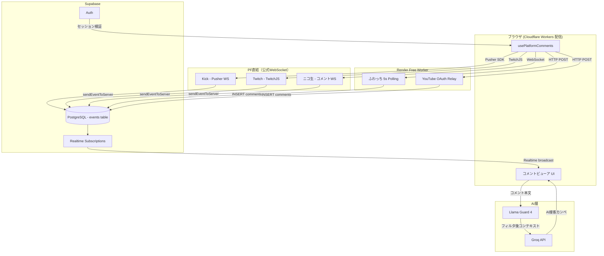
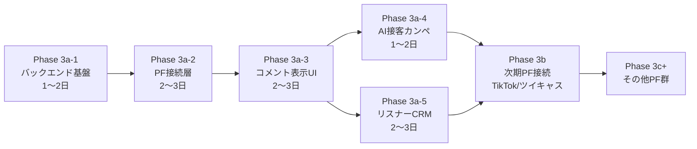

# TagDeck Phase 3 計画書 v0.1
# マルチプラットフォーム コメントビューア + AI接客カンペ + リスナーCRM

> **計画書バージョン**: v0.1
> **起案日**: 2026-05-10
> **起案者**: TagTech 社長（人間）
> **計画策定**: CTO 真鍋玲央 (Claude Code)
> **レビュー予定**: EXT_AUDIT 黒澤怜（独立第三者）
> **保存場所**: `D:\tagdeck\docs\migration\phase3_plan_v0.1.md`
> **前提資料**: `D:\tagdeck\docs\inventory_20260510.md` (現状棚卸し v1)

---

## 1. 目的・背景

### 1.1 Phase 2 完走の確認

| フェーズ | 内容 | 状態 |
|---|---|---|
| Phase 2 | 認証 (email+OAuth) + ダッシュボード基盤 | ✅ 完了 (commit 99c7c9a, 80db6f6) |
| Phase 4a/4b/4c | ふわっち / Kick / ニコ生 PF監視接続 | ✅ 完了 (main ブランチ) |
| Phase 5a/5b/5c | モンテカルロ + ベイズ + イベントトラッカー | ✅ 完了 (main ブランチ) |
| Phase 2-β | LP刷新 + SEO + 法務ページ + noindex解除 + 対応PFバッジ | ✅ 完了 (2026-05-10 push済み) |

### 1.2 Phase 3 の位置づけ

TagDeck の中核価値は「コメントビューア + AI接客カンペ + リスナーCRM」の3点である。これらが揃ってはじめて「配信者向けセカンドスクリーン SaaS」として機能する。Phase 2 までは認証・基盤・イベントシミュレーターを整備したが、コメント本文表示と CRM は未実装のままであった。Phase 3 はこれを完成させる。

### 1.3 案D-Hybrid v3 の確定経緯

Cloudflare Workers (Free プラン) の CPU 10ms/request 制約が、コメント常時接続 WebSocket サーバーの実装を阻む根本的な制約である。選択肢の比較:

| 案 | 構成 | 問題点 | 採否 |
|---|---|---|---|
| 案A | Cloudflare Workers only | Durable Objects (有料) が必要 | ❌ |
| 案B | Vercel Serverless | WebSocket 長時間接続非対応 | ❌ |
| 案C | Supabase Edge Functions | CPU 制約あり・WebSocket 未対応 | ❌ |
| 案D-Hybrid v3 | Cloudflare (Next.js) + Render Free (WebSocketサーバー) | コスト0・制約回避 | ✅ **採用** |

---

## 2. 完了定義 DoD

Phase 3 全体は以下5点すべて満たした時点でクローズとする:

1. ✅ Phase 3a 対応5PF（ふわっち / ニコニコ生放送 / Kick / YouTube Live / Twitch）のコメント本文がセカンドスクリーンにリアルタイム表示されている
2. ✅ AI接客カンペが BYOK または Groq 試食キー（10回/日/ユーザー）で動作している
3. ✅ リスナーCRM の PF横断名寄せが稼働・出禁フラグが全PFに反映されている
4. ✅ EXT_AUDIT 黒澤怜レビューが PASS
5. ✅ `npm run build` 成功・TypeScript エラー0件

---

## 3. 非ゴール（やらないこと）

本計画書のスコープ外として明示する。

- Phase 3b PF（TikTok Live / ツイキャス）の実装（→ Phase 3b で対応）
- Phase 3c+ PF群（Pococha / REALITY / BIGO LIVE / ミクチャ / 17LIVE）の実装
- OBS オーバーレイ連携 / わんコメ / Social Stream Ninja 互換機能
- **複雑な違反通報フロー・法的措置の自動化**（シンプルなAIモデレーションは §7 Phase 3a-4 に含む）
- 商標出願手続きの代行（CLO 氷室静の領域）
- Phase 3a-3 以前の UI を実運用リリースする義務（β継続のまま段階的公開）
- OGP 画像・動画生成の自動化（Phase 2-β で静的OGP実装済み）

---

## 4. 設計判断（社長承認済み）

| # | 分岐 | 決定 | 理由 |
|---|---|---|---|
| ① | バックエンドホスト | **Render Free** | コスト0・WebSocket長時間接続対応・Node.js runtime 利用可 |
| ② | Render Free vs Fly.io | **Render Free 採用** | 無料枠の帯域制限が緩い（月100GB）・スリープ後の復帰が比較的早い・設定シンプル |
| ③ | AI API 提供方式 | **BYOK + Groq試食キー** | 無料枠で提供可能・ユーザーが主体的に鍵を管理・コスト責任の分離 |
| ④ | PF対応の段階分割 | **3a / 3b / 3c+ の3段階** | 価値の早期提供・法務リスク分散・技術難易度の段階化 |
| ⑤ | SEO公開強行 | **商標未出願のまま公開（2026-05-10）** | 認知拡大を優先。第9類（コンピュータソフトウェア）+ 第42類（SaaS提供）の自力出願（¥24,000）を金銭余裕成立次第即時着手。それまでは J-PlatPat 日次監視を継続 |

---

## 5. アーキテクチャ詳細

### 5.1 レイヤー別構成表

| レイヤー | 採用技術 | ホスト | 役割 |
|---|---|---|---|
| フロントエンド | Next.js 16.2 App Router + React 19 | Cloudflare Workers | UI全体・SSR・コメント表示 |
| 認証 | Supabase Auth | Supabase Cloud | email + OAuth（X / YouTube/Google） |
| Realtime配信 | Supabase Realtime | Supabase Cloud | コメント挿入イベントのブロードキャスト |
| WebSocketサーバー | Node.js (ws ライブラリ) | Render Free | ふわっち5sポーリング + YouTube OAuth中継 |
| PF接続（ブラウザ直結） | pusher-js / TwitchJS / ネイティブWS | クライアント | Kick / Twitch / ニコ生 |
| AI接客カンペ | Llama 3.3 70B (生成) + Llama Guard 4 (モデレーション) | Groq Cloud | BYOK + 試食10回/日 |
| DB / キャッシュ | Supabase PostgreSQL + Drizzle ORM + Zustand | Supabase + クライアント | コメント永続化・リスナープロファイル |

### 5.2 データフロー図（Mermaid）

### 5.3 PF経路分岐の根拠

| PF | 接続方式 | 根拠 |
|---|---|---|
| Kick | ブラウザ直結（Pusher WS） | 公式 Pusher appKey が公開固定値・既存実装済み |
| Twitch | ブラウザ直結（TwitchJS） | 公式 EventSub / IRC WebSocket が公開・CORS制限なし |
| ニコ生 | ブラウザ直結（公式コメントWS） | NDGR 公式 WebSocket が公開・現状はカウントのみ取得を本文取得に拡張 |
| ふわっち | Render経由（5sポーリング第一・非公式WS第二） | 公式WS非公開。詳細は §10 スタンス参照 |
| YouTube Live | Render経由（OAuth + YouTube Live Chat API） | OAuth 必須・トークンはサーバー側で管理が必要 |

---

## 6. 5フェーズ全体像

> **並行実施**: Phase 3a-4（AI接客カンペ）と Phase 3a-5（リスナーCRM）は Phase 3a-3 完了後に並行実施可。DB設計の競合がないことを事前確認すること（§12 EXT_AUDIT 観点 A1 参照）。

各フェーズ完了時: smoke test → git コミット → Discord 通知（CHRO 南雲陽菜経由）を実施。

---

## 7. Phase 詳細

### 7.1 Phase 3a-1: バックエンド基盤

**目的**: Render Free 上に WebSocket中継サーバーを構築し、Supabase Realtime との結合を確立する。認証を YouTube/Google OAuth に対応拡張する。

**作業内容**:
- Render Free アカウント設定・Node.js (ws) サーバーデプロイ・環境変数設定
- Supabase Realtime チャンネル設計（PF別 channel 命名規則）
- YouTube / Google OAuth の Supabase Auth への追加設定
- Render Worker ↔ Supabase DB の INSERT 疎通テスト
- `workers/fuwacchi-poller/` と `workers/youtube-relay/` の雛形配置（現在空ディレクトリ）

**成果物**:
- Render Free 上で動作する WebSocket中継サーバー（URL確定）
- Supabase Auth: YouTube/Google OAuth 追加済み
- 疎通確認スクリプト（Vitest）

**完了基準**:
- Render Worker がコメント1件を Supabase DB に INSERT できること
- Supabase Realtime でクライアントがその INSERT を受信できること
- YouTube OAuth フローが完了できること

**所要時間**: 1〜2日

**リスク**: Render Free コールドスタート遅延（最大500ms+）が初回ユーザー体験に影響する（→ Keep-alive ping 実装で緩和）

---

### 7.2 Phase 3a-2: PF接続層

**目的**: Phase 3a で対象とする5PF全ての接続経路を実装し、コメント本文が Supabase DB に格納される状態にする。

**作業内容**:
- **Kick**: 既存 `src/hooks/useKickMonitor.ts` の `chat_message` 格納経路を DB INSERT まで拡張
- **Twitch**: TwitchJS 導入・chat_message イベント → DB INSERT
- **ニコ生**: 公式コメントWebSocket からコメント本文取得・格納（現在はカウントのみ）
- **ふわっち**: Render Worker 経由 5sポーリング実装（§10 スタンスに基づき非公式WS調査を並行実施）
- **YouTube Live**: Render Worker 経由 OAuth → YouTube Live Chat API → DB INSERT

**成果物**:
- `src/hooks/usePlatformComments.ts`（5PF統合カスタムフック）
- `src/app/api/platforms/*/comments/route.ts`（PF別コメント格納API）
- `workers/fuwacchi-poller/index.ts` / `workers/youtube-relay/index.ts`

**完了基準**: 5PF全てでコメント本文が Supabase DB の `events` テーブルに格納されること

**所要時間**: 2〜3日

**リスク**: ふわっちコメント本文取得手段（§10 参照）・YouTube Quota 上限（10,000 units/日）

---

### 7.3 Phase 3a-3: コメント表示UI

**目的**: 配信者のセカンドスクリーン（モバイル / タブレット）でコメントがリアルタイムに流れる UI を実装する。

**作業内容**:
- `src/components/shared/CommentFeed.tsx` 新規作成（Supabase Realtime 購読・スムーズスクロール）
- PF アイコン・配信者名バッジ表示（ふわっち/Kick/ニコ生/YouTube/Twitch 別アイコン）
- `src/app/(dashboard)/viewer/page.tsx` 新規作成（セカンドスクリーン専用ビュー）
- モバイルファーストレイアウト（`src/hooks/useResponsive.ts` 活用）
- `src/components/shared/` の空ディレクトリを解消

**成果物**:
- `src/components/shared/CommentFeed.tsx`
- `src/app/(dashboard)/viewer/page.tsx`

**完了基準**: 5PF混在コメントが PFアイコン付きで表示・スムーズスクロール・Supabase Realtime 受信レイテンシ 1秒以内

**所要時間**: 2〜3日

**リスク**: framer-motion バンドルサイズ超過（Cloudflare 25MiB 上限）→ `next/dynamic` で遅延ロード必須

---

### 7.4 Phase 3a-4: AI接客カンペ + コメントモデレーション

**目的**: リスナーの発言コンテキストと過去ギフト/コメント履歴から、配信者向けの接客カンペを Llama 3.3 70B で生成する。Llama Guard 4 による不適切コメント検出（モデレーション）を組み込む。

**作業内容**:
- `src/app/(dashboard)/ai-prompter/page.tsx` 実装（現在スタブ・ディレクトリのみ存在）
- Groq API クライアント実装（BYOK設定 + 試食キーフォールバック）
- Llama 3.3 70B プロンプト設計（リスナー名・ギフト履歴・直近コメント3件をコンテキスト）
- Llama Guard 4 モデレーション統合（不適切コメントに `moderated` フラグを付与・UI で非表示化）
- 試食キー管理: 1日10回/ユーザー上限（Supabase DB でカウント管理）
- BYOK 設定 UI: `src/app/(dashboard)/settings/ai/page.tsx` 新規作成

**成果物**:
- `src/app/(dashboard)/ai-prompter/page.tsx`
- `src/app/(dashboard)/settings/ai/page.tsx`
- `src/lib/ai/groq-client.ts`

**完了基準**: BYOK とフォールバック両方でカンペ生成動作・Llama Guard 4 が不適切コメントにフラグを付与すること・10回/日の上限制御が機能すること

**所要時間**: 1〜2日

**リスク**: R4 Groq 試食キーレート枯渇（§9参照）・Llama Guard 4 の誤検知（過検知 / 見逃し）

---

### 7.5 Phase 3a-5: リスナーCRM（PF横断名寄せ）

**目的**: 複数PFで同一リスナーを認識し、名前メモ・出禁フラグを管理する CRM を実装する。

**作業内容**:
- 名寄せロジック設計（表示名の類似度スコア・同一セッションでの出現パターン・手動マージUI）
- `src/components/crm/` 実装（現在空ディレクトリを解消）
  - `ListenerMergeView.tsx`（PF横断リスナー一覧・名寄せ候補提示）
  - `BanFlagControl.tsx`（出禁フラグ切替・メモ記入）
- `crm-filter-store.ts`（既存Zustandストア）との接続
- Supabase RLS でユーザー別データ分離を確認

**成果物**:
- `src/components/crm/ListenerMergeView.tsx`
- `src/components/crm/BanFlagControl.tsx`

**完了基準**: 同一リスナーが複数PFで名寄せされ、メモ・出禁フラグが全PFに反映されること

**所要時間**: 2〜3日

**リスク**: R10 名寄せ誤合体によるプライバシー問題（自動マージは低信頼度では保留・手動確認UIを必須化）

---

## 8. 帯域・スケール見積もり

想定: **同接80人 × 5PF × 5時間/配信 × 25配信/月**

| 指標 | 計算式 | 月間推定値 | 無料上限 | 判定 |
|---|---|---|---|---|
| Supabase Realtime メッセージ | 80人 × 1msg/5s × 18,000s × 25日 | 約720万msg | 200万msg/月 | ⚠️ **超過リスク大** |
| Supabase DB 転送量 | 1コメント~200B × 720万 | ~1.4GB | 5GB/月 | ✅ 余裕あり |
| Render Free 帯域 | ふわっち+YouTube中継（概算） | ~数百MB | 100GB/月 | ✅ 余裕あり |
| Groq 試食API コール | 10回/日 × 想定100ユーザー × 25日 | 25,000回 | 無料枠次第 | ⚠️ 要監視 |
| YouTube Quota | 1クエリ~100units × 配信中5分毎 | ~1,500units/配信 | 10,000units/日 | ✅ 余裕あり |

**主要ボトルネック**: Supabase Realtime メッセージ数が無料上限の約3.6倍。

**対策オプション（優先順）**:
1. Realtime の送信を「全コメント → 差分（5秒以内の新着のみ）」に絞り込む
2. コメントの Realtime 配信をクライアント側 polling（5秒間隔）に置き換える（Realtime 依存を削減）
3. Supabase Pro（$25/月）へのアップグレード（Realtime 5,000万msg/月）

---

## 9. リスク登録

| ID | リスク | 影響度 | 発生確率 | 対策 |
|---|---|---|---|---|
| R1 | Render Free コールドスタート遅延（最大500ms+） | 中 | 高 | Keep-alive ping 実装・スリープ回避設定 |
| R2 | ふわっちコメント本文取得手段の欠如 | 高 | 中 | 5sポーリングを維持しつつ非公式WS可否を CISO が 2026-05-31 までに判断（§10） |
| R3 | Cloudflare Workers CPU time 超過 | 中 | 低 | Durable Objects 導入 or 重い処理を Render 側に移管 |
| R4 | Groq 試食キーレート枯渇 | 中 | 中 | BYOK 誘導強化・Gemini Free / Claude Haiku へのフォールバック |
| R5 | ニコ生コメントWS 仕様変更 | 高 | 低 | 公式ドキュメント・GitHub 変更ログの週次監視・フォールバックポーリング準備 |
| R6 | Supabase Realtime 月間メッセージ上限超過 | 高 | 高 | §8 対策オプション1→2→3 の順で段階対応 |
| R7 | BYOK 管理UX の煩雑さによるユーザー離脱 | 中 | 中 | 試食キー体験を充実させ初期摩擦を下げる・設定ウィザード実装 |
| R8 | 「TagDeck」商標の他者先願 | 高 | 低〜中 | J-PlatPat 日次監視・¥24,000 自力出願を最速実施（§4 決定⑤） |
| R9 | Render Free の廃止・有料化 | 高 | 低 | Fly.io Free / Railway Free への移行手順を先行ドキュメント化 |
| R10 | CRM名寄せ誤合体によるプライバシー問題 | 中 | 中 | 手動確認UIを必須化・自動マージは信頼度閾値を設け低信頼は保留 |

---

## 10. ふわっちスタンス v1.0

### 10.1 現行制約の確認（AGENTS.md より）

`D:\tagdeck\AGENTS.md` に以下が明記されている:
- 「ふわっちは公開 API（api.whowatch.tv/lives2 等）の 5 秒ポーリングのみ」
- 「非公式 WebSocket、内部プロトコル解析、リバースエンジニアリング系の処理は実装してはならない」

### 10.2 社長判断による方針更新（2026-05-10）

| 優先順位 | 方式 | 説明 |
|---|---|---|
| **第一選択** | HTTP REST ポーリング（5秒間隔） | 既存実装を Render Free 経由で継続。安全性・安定性最優先 |
| **第二選択** | 非公式 WebSocket | 負荷削減・コメント本文取得のため **解禁（社長判断）**。CISO レビュー完了後に本格採用 |

### 10.3 非公式WS利用時の緩和策

非公式 WebSocket を採用する場合、以下すべてを実装すること:

1. **User-Agent の適切化**: ブラウザ相当の User-Agent 文字列を設定（bot判定回避）
2. **最低5秒間隔の遵守**: 高頻度アクセスによるサーバー負荷増加を防止
3. **ブロック検出時の自動停止**: HTTP 429 / 接続切断を検知した場合は即座に停止し、第一選択（REST ポーリング）へフォールバック
4. **障害時 Discord 通知**: CHRO 南雲陽菜 Webhook 経由で即報

### 10.4 CISO 葦原隼レビュータスク

- **期限**: 2026-05-31
- **内容**: `whowatch.tv/terms-of-service.html` の精読・非公式 WebSocket 接続の可否判断
- **判断が「否」の場合**: 即座に第一選択（5sポーリング）に戻し AGENTS.md を更新
- **法的最終判断**: CISO + CLO 氷室静の合議による。本計画書はスタンス記録のみ。法的結論は本計画書では出さない。

---

## 11. 用語統一（計画書 v1.0 準拠）

| 用語 | 定義 | 禁止表現・補足 |
|---|---|---|
| 配信者 | TagDeck を使用するライブ配信実施者 | — |
| リスナー | 配信視聴者 | 「ファン」は非推奨（マーケ文脈除く） |
| AIエージェント | 自律的に業務を実行するAI | **「AI社員」「AI従業員」全面禁止** |
| PF | 配信プラットフォーム（ふわっち/ニコ生/Kick 等） | 「プラットフォーム」と略さず使用可 |
| TagTech | 本事業主体（個人事業） | **「会社」「弊社」全面禁止** |
| 当方 | TagTech の一人称（外部向け） | 「弊社」禁止 |
| ¥xxxx | 金額表記 | 「xxk」「¥xx万円」の重複表記禁止 |
| フルパス | ファイル参照 | 相対パス・省略パス禁止（例: `D:\tagdeck\src\...`） |
| コメント | 視聴者がPFに投稿したテキスト | 「メッセージ」と区別しない（文脈依存） |
| ギフト | 視聴者が送るアイテム・投げ銭 | — |

---

## 12. EXT_AUDIT 黒澤怜 レビュー観点

外部監査役 黒澤怜に対し、以下7点のレビューを依頼する。辛口・読者視点での指摘を求める。

| # | 観点 | 確認ポイント |
|---|---|---|
| A1 | 段階分割の妥当性 | Phase 3a-4（AI）と 3a-5（CRM）を 3a-3 完了後に並行としたが、`events` テーブルと `listeners` テーブルへの同時スキーマ変更で DB設計の競合リスクはないか |
| A2 | データ消失耐性 | Render Free Worker が再起動した際に、INSERT 途中のコメントが消失しないか。トランザクション保護の設計が必要ではないか |
| A3 | コールドスタートのUX影響 | 初回アクセス時に 500ms+ の遅延が発生する。ローディング表示だけで許容できるか。ユーザーが「壊れた」と誤認しないか |
| A4 | スケール試算の前提 | Supabase Realtime 超過リスクが「高」とされているにも関わらず、Phase 3a-3 開始時の対策が「差分送信」のみで十分か。Pro 移行の意思決定基準（ユーザー数 or メッセージ数の閾値）が曖昧ではないか |
| A5 | ふわっちスタンスの法務リスク残存 | CISO レビュー前（2026-05-31 まで）に非公式 WS を実装・デプロイすることへの TOS 違反リスクが残存する。緩和策で実質的に許容レベルまで低減されているか |
| A6 | BYOK 鍵管理のセキュリティ | ユーザーの Groq API キーを Supabase DB に保存する場合の暗号化方式・アクセス制御（RLS）が本計画書に明示されていない。Phase 3a-4 実装前に設計が必要ではないか |
| A7 | CRM名寄せのプライバシー整合性 | 複数PFのリスナー情報を横断結合する行為が各PF利用規約に抵触しないか。日本の個人情報保護法（改正個人情報保護法）との整合性を Phase 3a-5 着手前に確認すべきではないか |

---

*以上。Phase 3 計画書 v0.1 終了。v1.0 化は EXT_AUDIT レビュー + 社長承認後。*
