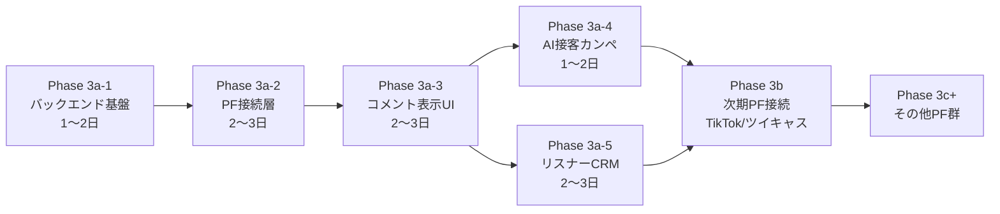

# TagDeck Phase 3 計画書 v1.0
# マルチプラットフォーム コメントビューア + AI接客カンペ + リスナーCRM

> **計画書バージョン**: v1.0
> **起案日**: 2026-05-10
> **更新日**: 2026-05-11
> **起案者**: TagTech 社長（人間）
> **計画策定**: CTO 真鍋玲央 (Claude Code)
> **レビュー完了**: EXT_AUDIT 黒澤怜（独立第三者）— GO 即時 v1.0 化推奨 (commit fea21ff)
> **保存場所**: `D:\tagdeck\docs\migration\phase3_plan_v1.0.md`
> **前提資料**: `D:\tagdeck\docs\inventory_20260510.md` (現状棚卸し v1)

---

## 1. 目的・背景

### 1.1 Phase 2 完走の確認

| フェーズ | 内容 | 状態 |
|---|---|---|
| Phase 2 | 認証 (email+OAuth) + ダッシュボード基盤 | ✅ 完了 (commit 99c7c9a, 80db6f6) |
| Phase 4a/4b/4c | ふわっち / Kick / ニコ生 PF監視接続 | ✅ 完了 (main ブランチ) |
| Phase 5a/5b/5c | モンテカルロ + ベイズ + イベントトラッカー | ✅ 完了 (main ブランチ) |
| Phase 2-β | LP刷新 + SEO + 法務ページ + noindex解除 + 対応PFバッジ | ✅ 完了 (2026-05-10 push済み) |

### 1.2 Phase 3 の位置づけ

TagDeck の中核価値は「コメントビューア + AI接客カンペ + リスナーCRM」の3点である。これらが揃ってはじめて「配信者向けセカンドスクリーン SaaS」として機能する。Phase 2 までは認証・基盤・イベントシミュレーターを整備したが、コメント本文表示と CRM は未実装のままであった。Phase 3 はこれを完成させる。

### 1.3 案D-Hybrid v3 の確定経緯

Cloudflare Workers (Free プラン) の CPU 10ms/request 制約が、コメント常時接続 WebSocket サーバーの実装を阻む根本的な制約である。選択肢の比較:

| 案 | 構成 | 問題点 | 採否 |
|---|---|---|---|
| 案A | Cloudflare Workers only | Durable Objects (有料) が必要 | ❌ |
| 案B | Vercel Serverless | WebSocket 長時間接続非対応 | ❌ |
| 案C | Supabase Edge Functions | CPU 制約あり・WebSocket 未対応 | ❌ |
| 案D-Hybrid v3 | Cloudflare (Next.js) + Render Free (WebSocketサーバー) | コスト0・制約回避 | ✅ **採用** |

---

## 2. 完了定義 DoD

Phase 3 全体は以下5点すべて満たした時点でクローズとする:

1. ✅ Phase 3a 対応5PF（ふわっち / ニコニコ生放送 / Kick / YouTube Live / Twitch）のコメント本文がセカンドスクリーンにリアルタイム表示されている
2. ✅ AI接客カンペが BYOK または Groq 試食キー（10回/日/ユーザー）で動作している
3. ✅ リスナーCRM の PF横断名寄せが稼働・出禁フラグが全PFに反映されている
4. ✅ EXT_AUDIT 黒澤怜レビューが PASS
5. ✅ `npm run build` 成功・TypeScript エラー0件

---

## 3. 非ゴール（やらないこと）

本計画書のスコープ外として明示する。

- Phase 3b PF（TikTok Live / ツイキャス）の実装（→ Phase 3b で対応）
- Phase 3c+ PF群（Pococha / REALITY / BIGO LIVE / ミクチャ / 17LIVE）の実装
- OBS オーバーレイ連携 / わんコメ / Social Stream Ninja 互換機能
- **複雑な違反通報フロー・法的措置の自動化**（シンプルなAIモデレーションは §7 Phase 3a-4 に含む）
- 商標出願手続きの代行（CLO 氷室静の領域）
- Phase 3a-3 以前の UI を実運用リリースする義務（β継続のまま段階的公開）
- OGP 画像・動画生成の自動化（Phase 2-β で静的OGP実装済み）

---

## 4. 設計判断（社長承認済み）

| # | 分岐 | 決定 | 理由 |
|---|---|---|---|
| ① | バックエンドホスト | **Render Free 採用** | コスト0・WebSocket長時間接続対応・Node.js runtime・無料枠帯域月100GB・スリープ後復帰・設定シンプル |
| ② | AI API 提供方式 | **BYOK + Groq試食キー** | 無料枠で提供可能・ユーザーが主体的に鍵を管理・コスト責任の分離 |
| ③ | PF対応の段階分割 | **3a / 3b / 3c+ の3段階** | 価値の早期提供・法務リスク分散・技術難易度の段階化 |
| ④ | SEO公開強行 | **商標未出願のまま公開（2026-05-10）** | 認知拡大を優先。第9類（コンピュータソフトウェア）+ 第42類（SaaS提供）の自力出願（¥24,000）を金銭余裕成立次第即時着手。それまでは J-PlatPat 日次監視を継続 |

---

## 5. アーキテクチャ詳細

### 5.1 レイヤー別構成表

| レイヤー | 採用技術 | ホスト | 役割 |
|---|---|---|---|
| フロントエンド | Next.js 16.2 App Router + React 19 | Cloudflare Workers | UI全体・SSR・コメント表示 |
| 認証 | Supabase Auth | Supabase Cloud | email + OAuth（X / YouTube/Google） |
| Realtime配信 | Supabase Realtime | Supabase Cloud | コメント挿入イベントのブロードキャスト |
| WebSocketサーバー | Node.js (ws ライブラリ) | Render Free | ふわっち5sポーリング + YouTube OAuth中継 |
| PF接続（ブラウザ直結） | pusher-js / TwitchJS / ネイティブWS | クライアント | Kick / Twitch / ニコ生 |
| AI接客カンペ | Llama 3.3 70B (生成) + Llama Guard 4 (モデレーション) | Groq Cloud | BYOK + 試食10回/日 |
| DB / キャッシュ | Supabase PostgreSQL + Drizzle ORM + Zustand | Supabase + クライアント | コメント永続化・リスナープロファイル |

### 5.2 データフロー図（Mermaid）

```mermaid
graph TB
    subgraph Browser["ブラウザ (Cloudflare Workers 配信)"]
        UI[コメントビューア UI]
        Hook[usePlatformComments]
    end

    subgraph RenderFree["Render Free Worker"]
        FW[ふわっち 5s Polling]
        YT[YouTube OAuth Relay]
    end

    subgraph PFDirect["PF直結（公式WebSocket）"]
        Kick[Kick - Pusher WS]
        Twitch[Twitch - TwitchJS]
        Nico[ニコ生 - コメントWS]
    end

    subgraph Supabase["Supabase"]
        RT[Realtime Subscriptions]
        DB[(PostgreSQL - events table)]
        Auth[Auth]
    end

    subgraph AILayer["AI層"]
        Groq[Groq API]
        Guard[Llama Guard 4]
    end

    Hook -->|Pusher SDK| Kick
    Hook -->|TwitchJS| Twitch
    Hook -->|WebSocket| Nico
    Hook -->|HTTP POST| FW
    Hook -->|HTTP POST| YT
    FW -->|INSERT comments| DB
    YT -->|INSERT comments| DB
    Kick -->|直接 UI更新(Zustand)| UI
    Twitch -->|直接 UI更新(Zustand)| UI
    Nico -->|直接 UI更新(Zustand)| UI
    Kick -. 永続化+他デバイス .-> DB
    Twitch -. 永続化+他デバイス .-> DB
    Nico -. 永続化+他デバイス .-> DB
    DB --> RT
    RT -->|Realtime broadcast| UI
    UI -->|コメント本文| Guard
    Guard -->|フィルタ後コンテキスト| Groq
    Groq -->|AI接客カンペ| UI
    Auth -->|セッション検証| Hook
```

### 5.3 PF経路分岐の根拠

| PF | 接続方式 | Realtime 購読対象 | 根拠 |
|---|---|---|---|
| Kick | ブラウザ直結（Pusher WS） | 他デバイス時のみ | 公式 Pusher appKey が公開固定値・既存実装済み |
| Twitch | ブラウザ直結（TwitchJS） | 他デバイス時のみ | 公式 EventSub / IRC WebSocket が公開・CORS制限なし |
| ニコ生 | ブラウザ直結（公式コメントWS） | 他デバイス時のみ | NDGR 公式 WebSocket が公開・現状はカウントのみ取得を本文取得に拡張 |
| ふわっち | Render経由（5sポーリング第一・非公式WS第二） | 常時 | 公式WS非公開。詳細は §10 スタンス参照 |
| YouTube Live | Render経由（OAuth + YouTube Live Chat API） | 常時 | OAuth 必須・トークンはサーバー側で管理が必要 |

**【C1 解消】DB スキーマ参照**: Phase 3a-4（AI接客カンペ）・Phase 3a-5（リスナーCRM）の並行実施に係る全テーブルの DDL・ER 図・RLS ポリシーは `D:\tagdeck\docs\migration\phase3_db_design_v0.md`（v0.1）に完備されている。本計画書では DDL を重複記載しない。

---

## 6. Phase 3 全体像(3a 5サブ + 3b/3c+)



> **並行実施**: Phase 3a-4（AI接客カンペ）と Phase 3a-5（リスナーCRM）は Phase 3a-3 完了後に並行実施可。DB設計の競合がないことを事前確認すること（§13 EXT_AUDIT 観点 A1 参照）。**[v0.4 確認済]** `D:\tagdeck\docs\migration\phase3_db_design_v0.md`（v0.1）で全6エンティティのスキーマを定義し、Phase 3a-4 / 3a-5 間の競合がないことを確認済み（events テーブル追加カラム3本と新規5テーブルで分離）。

各フェーズ完了時: smoke test → git コミット → Discord 通知（CHRO 南雲陽菜経由）を実施。

---

## 7. Phase 詳細

### 7.1 Phase 3a-1: バックエンド基盤

**目的**: Render Free 上に WebSocket中継サーバーを構築し、Supabase Realtime との結合を確立する。認証を YouTube/Google OAuth に対応拡張する。

**作業内容**:
- Render Free アカウント設定・Node.js (ws) サーバーデプロイ・環境変数設定
- Supabase Realtime チャンネル設計（PF別 channel 命名規則）
- YouTube / Google OAuth の Supabase Auth への追加設定
- Render Worker ↔ Supabase DB の INSERT 疎通テスト
- `workers/fuwacchi-poller/` と `workers/youtube-relay/` の雛形配置（現在空ディレクトリ）

**成果物**:
- Render Free 上で動作する WebSocket中継サーバー（URL確定）
- Supabase Auth: YouTube/Google OAuth 追加済み
- 疎通確認スクリプト（Vitest）

**完了基準**:
- Render Worker がコメント1件を Supabase DB に INSERT できること
- Supabase Realtime でクライアントがその INSERT を受信できること
- YouTube OAuth フローが完了できること

**所要時間**: 1〜2日

**リスク**: Render Free コールドスタート遅延が初回ユーザー体験に影響する。通常時: 500ms 未満（Keep-alive ping 稼働中）・強制再起動時: 最大約1分（Render 公式情報 render.com/docs/free）。UI 側で fetch timeout 60秒 + ローディング表示を必須実装とする（→ Keep-alive ping 実装で緩和）

---

### 7.2 Phase 3a-2: PF接続層

**目的**: Phase 3a で対象とする5PF全ての接続経路を実装し、コメント本文が Supabase DB に格納される状態にする。

**作業内容**:
- **Kick**: 既存 `src/hooks/useKickMonitor.ts` の `chat_message` 格納経路を DB INSERT まで拡張
- **Twitch**: TwitchJS 導入・chat_message イベント → DB INSERT
- **ニコ生**: 公式コメントWebSocket からコメント本文取得・格納（現在はカウントのみ）
- **ふわっち**: Render Worker 経由 5sポーリング実装（§10 スタンスに基づき非公式 WS の**ドキュメント・第三者実装の確認（調査）**を並行実施する。**実装着手は §10.4 の CISO+CLO 合議承認後**に限る。→ 実装許可範囲の詳細は §10.4 を参照）
- **YouTube Live**: Render Worker 経由 OAuth → YouTube Live Chat API → DB INSERT

**成果物**:
- `src/hooks/usePlatformComments.ts`（5PF統合カスタムフック）
- `src/app/api/platforms/*/comments/route.ts`（PF別コメント格納API）
- `workers/fuwacchi-poller/index.ts` / `workers/youtube-relay/index.ts`

**完了基準**: 5PF全てでコメント本文が Supabase DB の `events` テーブルに格納されること

**【E5 反映】events テーブル追加カラム（DB 設計 v0.1 より）**:

Phase 3a-2 実装時に以下3カラムを events テーブルに追加する。DDL 詳細は `D:\tagdeck\docs\migration\phase3_db_design_v0.md` §3.1〜§3.2 参照。

| カラム | 型 | NULL | 用途 |
|---|---|---|---|
| `stream_id` | text | NULL 許容→段階的 NOT NULL 化 | ニコ生 thread_id・他PFの配信回識別子 |
| `platform_comment_id` | text | NULL 許容（ふわっちのみ NULL） | 冪等性キー（ふわっちはアプリ層 dedup） |
| `moderated` | boolean | NOT NULL DEFAULT false | Phase 3a-4 で Llama Guard 結果格納 |

**【E5 反映】PF 別冪等性キー対応表**:

| PF | キー有無 | DB 制約 |
|---|---|---|
| Kick | ○（UUID） | `(platform, platform_comment_id)` UNIQUE |
| Twitch | ○（UUID） | `(platform, platform_comment_id)` UNIQUE |
| YouTube | ○（YouTube ID） | `(platform, platform_comment_id)` UNIQUE |
| ニコ生 | △（配信内で一意） | `(platform, stream_id, platform_comment_id)` 3カラム複合 UNIQUE |
| ふわっち | ×（固有ID なし） | DB 制約不可・アプリ層 dedup 必須（下記参照） |

**【C2・L1-3 解消】ふわっちコメント重複対策とID不在の確認**:

ふわっち公開 API（`api.whowatch.tv/lives` ポーリング）はコメント固有 ID フィールドを持たない（E5 mini-task 確認済・公式 API ドキュメント非公開のためコミュニティ実装ベース）。したがって `events` テーブルの DB 制約による重複検知は不可能であり、Render Worker のアプリ層 in-memory キャッシュで dedup 実装を必須とする（前回取得分との差分のみ INSERT）。他4PF は `(platform, platform_comment_id)` UNIQUE 制約で重複検知。ニコ生は `(platform, stream_id, platform_comment_id)` の3カラム複合 UNIQUE。

非公式 WS が CISO+CLO 合議承認後（2026-05-31 期限・§10.4）に有効化された時点で、専用 ID ベースの DB 制約に切替予定。

**所要時間**: 2〜3日

**リスク**: ふわっちコメント本文取得手段（§10 参照）・YouTube Quota 上限（10,000 units/日）

---

### 7.3 Phase 3a-3: コメント表示UI

**目的**: 配信者のセカンドスクリーン（モバイル / タブレット）でコメントがリアルタイムに流れる UI を実装する。

**作業内容**:
- `src/components/shared/CommentFeed.tsx` 新規作成（Supabase Realtime 購読・スムーズスクロール）
- PF アイコン・配信者名バッジ表示（ふわっち/Kick/ニコ生/YouTube/Twitch 別アイコン）
- `src/app/(dashboard)/viewer/page.tsx` 新規作成（セカンドスクリーン専用ビュー）
- モバイルファーストレイアウト（`src/hooks/useResponsive.ts` 活用）
- `src/components/shared/` の空ディレクトリを解消

**成果物**:
- `src/components/shared/CommentFeed.tsx`
- `src/app/(dashboard)/viewer/page.tsx`

**完了基準**: 5PF混在コメントが PFアイコン付きで表示・スムーズスクロール・Supabase Realtime 受信レイテンシ 1秒以内

**所要時間**: 2〜3日

**リスク**: framer-motion バンドルサイズ超過（Cloudflare 25MiB 上限）→ `next/dynamic` で遅延ロード必須

---

### 7.4 Phase 3a-4: AI接客カンペ + コメントモデレーション

**目的**: リスナーの発言コンテキストと過去ギフト/コメント履歴から、配信者向けの接客カンペを Llama 3.3 70B で生成する。Llama Guard 4 による不適切コメント検出（モデレーション）を組み込む。

**作業内容**:
- `src/app/(dashboard)/ai-prompter/page.tsx` 実装（現在スタブ・ディレクトリのみ存在）
- Groq API クライアント実装（BYOK設定 + 試食キーフォールバック）。**【C3 解消】BYOK 暗号化方式は Supabase Vault 採用**（libsodium AEAD・全プラン Free Tier 標準搭載）。マスター鍵は Supabase が per-database root key を管理し TagTech .env に存在しない。実装は SECURITY DEFINER ラッパー関数3本（`get_my_groq_key` / `set_my_groq_key` / `delete_my_groq_key`）を経由する。詳細は `D:\tagdeck\docs\migration\phase3_db_design_v0.md` §3.7・§4.2・§7 参照。
- Llama 3.3 70B プロンプト設計（リスナー名・ギフト履歴・直近コメント3件をコンテキスト）
- Llama Guard 4 モデレーション統合（不適切コメントに `moderated` フラグを付与・UI で非表示化）
- 試食キー管理: 1日10回/ユーザー上限（Supabase DB でカウント管理）
- BYOK 設定 UI: `src/app/(dashboard)/settings/ai/page.tsx` 新規作成

**成果物**:
- `src/app/(dashboard)/ai-prompter/page.tsx`
- `src/app/(dashboard)/settings/ai/page.tsx`
- `src/lib/ai/groq-client.ts`
- （注）**Phase 3a-4 では Groq クライアントのみ実装**。§9 R4 で言及される Gemini Free / Claude Haiku へのフォールバックは**将来対策の予告であり、本フェーズのスコープ外**。

**完了基準**: BYOK とフォールバック両方でカンペ生成動作・Llama Guard 4 が不適切コメントにフラグを付与すること・10回/日の上限制御が機能すること

**所要時間**: 1〜2日

**リスク**: R4 Groq 試食キーレート枯渇（§9参照）・Llama Guard 4 の誤検知（過検知 / 見逃し）

---

### 7.5 Phase 3a-5: リスナーCRM（PF横断名寄せ）

**目的**: 複数PFで同一リスナーを認識し、名前メモ・出禁フラグを管理する CRM を実装する。

**作業内容**:
- **【E1=C案採択】DB 設計**: `events` テーブルに `listener_id` FK を追加せず、`listener_platform_ids` を SSOT（真実の源）とする。配信ごとの行動履歴は `(platform, platform_user_id)` 複合インデックス経由で `listener_platform_ids` → `listeners` を JOIN して取得する。DDL 詳細は `D:\tagdeck\docs\migration\phase3_db_design_v0.md` §3.4・§3.5 参照。
- 名寄せロジック設計（表示名の類似度スコア・同一セッションでの出現パターン・手動マージUI）
- `src/components/crm/` 実装（現在空ディレクトリを解消）
  - `ListenerMergeView.tsx`（PF横断リスナー一覧・名寄せ候補提示）
  - `BanFlagControl.tsx`（出禁フラグ切替・メモ記入）
- `crm-filter-store.ts`（既存Zustandストア）との接続
- Supabase RLS でユーザー別データ分離を確認

**成果物**:
- `src/components/crm/ListenerMergeView.tsx`
- `src/components/crm/BanFlagControl.tsx`

**完了基準**: 同一リスナーが複数PFで名寄せされ、メモ・出禁フラグが全PFに反映されること

**所要時間**: 2〜3日

**リスク**: R10 名寄せ誤合体によるプライバシー問題（自動マージは低信頼度では保留・手動確認UIを必須化）

---

## 8. 帯域・スケール見積もり

想定: **同接80人 × 5PF × 5時間/配信 × 25配信/月**

| 指標 | 計算式 | 月間推定値 | 無料上限 | 判定 |
|---|---|---|---|---|
| Supabase Realtime メッセージ | §5.2 設計分離後（PF直結組は同一デバイス非購読） | 約140万msg | 200万msg/月 | ✅ 余裕あり |
| Supabase DB 転送量 | 1コメント~200B × 720万 | ~1.4GB | 5GB/月 | ✅ 余裕あり |
| Render Free 帯域 | ふわっち+YouTube中継（概算） | ~数百MB | 100GB/月 | ✅ 余裕あり |
| Groq 試食API コール | 10回/日 × 想定100ユーザー × 25日 | 25,000回 | 無料枠次第 | ⚠️ 要監視 |
| YouTube Quota | 1クエリ~100units × 配信中5分毎 | ~1,500units/配信 | 10,000units/日 | ✅ 余裕あり |

**主要ボトルネック**: §5.2 設計分離前は無料上限の約3.6倍超過 → 設計分離後は約0.7倍（余裕あり）。

**対策オプション（優先順）**:
1. Realtime の送信を「全コメント → 差分（5秒以内の新着のみ）」に絞り込む
2. コメントの Realtime 配信をクライアント側 polling（5秒間隔）に置き換える（Realtime 依存を削減）
3. Supabase Pro（¥3,500/月相当）へのアップグレード（Realtime 5,000万msg/月）

**【L1-1 解消】Pro 移行の意思決定基準（Supabase Free Tier 公式仕様 2026-05-11 確認）**:

以下のいずれかを満たした時点で Supabase Pro（¥3,500/月相当）移行を即時判断する:

| 指標 | 移行トリガー閾値 | Free Tier 上限 | 根拠 |
|---|---|---|---|
| 同時接続数 | 150 接続超過 | 200 接続 | 上限の 75%・余裕なくなる前に判断 |
| DB 容量 | 375MB 超過 | 500MB | 上限の 75%・読み取り専用移行の前に判断 |
| Render Free 稼働時間 | 700 時間/月 超過 | 750 時間/月 | 上限の 93%・上限到達前に Fly.io 等への移行着手 |

監視方法: Supabase ダッシュボード（Database → Usage）を月1回確認。いずれかの閾値到達時は CFO 金城律子へ即時報告し Pro 移行判断を仰ぐ。

---

## 9. リスク登録

| ID | リスク | 影響度 | 発生確率 | 対策 |
|---|---|---|---|---|
| R1 | Render Free コールドスタート遅延（通常時 500ms 未満・強制再起動時 最大約1分） | 中 | 高 | Keep-alive ping 実装（14分間隔 /health self-ping）・スリープ回避設定。UI 側で fetch timeout 60秒 + ローディング表示を必須実装（→ §7.1 参照） |
| R2 | ふわっちコメント本文取得手段の欠如 | 高 | 中 | 5sポーリングを維持しつつ非公式WS可否を CISO が 2026-05-31 までに判断（§10） |
| R3 | Cloudflare Workers CPU time 超過 | 中 | 低 | Durable Objects 導入 or 重い処理を Render 側に移管 |
| R4 | Groq 試食キーの技術的レート上限到達(発生時 BYOK 強制誘導の摩擦が発生) | 中 | 中 | BYOK 誘導強化・Gemini Free / Claude Haiku へのフォールバック（本対策は Phase 3a-4 完了後の評価事項・本フェーズのスコープ外） |
| R5 | ニコ生コメントWS 仕様変更 | 高 | 低 | 公式ドキュメント・GitHub 変更ログの週次監視・フォールバックポーリング準備 |
| R6 | Supabase Realtime 月間メッセージ上限超過 | 高 | 中 | §5.2 設計分離で根本解決（残余リスクは §8 対策オプション1→2→3） |
| R7 | BYOK 設定UIの摩擦(設定ウィザード未整備時のドロップオフ・新規ユーザーの離脱率上昇) | 中 | 中 | 試食キー体験を充実させ初期摩擦を下げる・設定ウィザード実装 |
| R8 | 「TagDeck」商標の他者先願 | 高 | 低〜中 | J-PlatPat 日次監視・¥24,000 自力出願を最速実施（§4 決定④） |
| R9 | Render Free の廃止・有料化 | 高 | 低 | Fly.io Free / Railway Free への移行手順を先行ドキュメント化 |
| R10 | CRM名寄せ誤合体によるプライバシー問題 | 中 | 中 | 手動確認UIを必須化・自動マージは信頼度閾値を設け低信頼は保留 |
| R11 | Llama Guard 4 モデレーション誤検知(過検知/見逃し) | 中 | 中 | フラグ閾値の調整UI実装・ユーザー側で moderated フラグの解除/手動付与可能化・運用フェーズで誤検知サンプルを Groq に送付して fine-tuning 検討 |

---

## 10. ふわっちスタンス v1.0

### 10.1 現行制約の確認（AGENTS.md より）

`D:\tagdeck\AGENTS.md` に以下が明記されている:
- 「ふわっちは公開 API（api.whowatch.tv/lives2 等）の 5 秒ポーリングのみ」
- 「非公式 WebSocket、内部プロトコル解析、リバースエンジニアリング系の処理は実装してはならない」

### 10.2 社長判断による方針更新（2026-05-10）

| 優先順位 | 方式 | 説明 |
|---|---|---|
| **第一選択** | HTTP REST ポーリング（5秒間隔） | 既存実装を Render Free 経由で継続。安全性・安定性最優先 |
| **第二選択** | 非公式 WebSocket | 負荷削減・コメント本文取得のため **解禁（社長判断）**。CISO レビュー完了後に本格採用 |

### 10.3 非公式WS利用時の緩和策

非公式 WebSocket を採用する場合、以下すべてを実装すること:

1. **User-Agent の適切化**: ブラウザ相当の User-Agent 文字列を設定（bot判定回避）
2. **最低5秒間隔の遵守**: 高頻度アクセスによるサーバー負荷増加を防止
3. **ブロック検出時の自動停止**: HTTP 429 / 接続切断を検知した場合は即座に停止し、第一選択（REST ポーリング）へフォールバック
4. **障害時 Discord 通知**: CHRO 南雲陽菜 Webhook 経由で即報

### 10.4 CISO 葦原隼レビュータスク

← §7.2 の作業範囲を以下のゲート設計で制約する（ふわっち非公式 WS の調査は許可・実装着手は本タスクの CISO+CLO 合議承認後）

- **期限**: 2026-05-31
- **内容**: `whowatch.tv/terms-of-service.html` の精読・非公式 WebSocket 接続の可否判断
- **判断が「否」の場合**: 即座に第一選択（5sポーリング）に戻し AGENTS.md を更新
- **法的最終判断**: CISO + CLO 氷室静の合議による。本計画書はスタンス記録のみ。法的結論は本計画書では出さない。
- **レビュー期間中の実装ルール**: 2026-05-31 までは第一選択(5sポーリング)のみ実装可。非公式WS 実装着手は CISO + CLO 合議の正式承認後に AGENTS.md を更新してから着手する。これにより AGENTS.md と計画書の矛盾期間を排除する。

---

## 11. データ資産化戦略（リスナーCRM 中心のロックイン設計）

### 11.1 戦略の意図と前提

本章の目的はベータ期の離脱率対策である。TagDeck 上で蓄積されたリスナーデータが配信者にとって替えの効かない資産となることで、サービスの継続利用動機を形成する。

**「健全ロックイン」の定義**（本章では内部用語として「ロックイン」を使用する。対外公開文書では別表現を検討すること）:

| 観点 | 健全ロックイン（採用方針） | 暗黒パターン（不採用） |
|---|---|---|
| データ持ち出し | CSV/JSON エクスポート提供 | 持ち出し不可・API 制限 |
| 削除権 | リスナー本人の削除請求権あり（GDPR / 個人情報保護法準拠） | 削除拒否・部分削除のみ |
| 移行コスト | 再構築コストが高い（データ構造・累積量による自然な壁） | 独自形式で他サービス非互換 |
| 解約時 | 解約後30日間は再ログインでデータ復元可 | 解約時に全消去（報復型） |

健全ロックインの本質は「持ち出せるが、再構築が現実的でないほど価値が蓄積されている状態」であり、暗黒パターンとの違いは技術的障壁ではなく累積価値による。

---

### 11.2 S級資産: リスナーCRM の PF横断名寄せ（ベータ即時・Phase 3a-5 スコープ）

Phase 3a-5 で実装するリスナーCRM は、TagDeck の中核差別化資産となる。

**管理データ項目**:

| 項目 | 内容 |
|---|---|
| PF横断 ID 名寄せ | Twitch:userX = YouTube:userY = ふわっち:userZ の対応表 |
| 自由メモ | タグ付き・全文検索対応 |
| 出禁・要注意フラグ | 配信者による主観評価（任意） |
| 投げ銭累計 / コメント頻度 | PF 別・合算の自動集計 |
| タイムライン | 初回参加日・最終来訪日・配信ごとの行動履歴 |

**移行不可度の根拠**:
- CSV/JSON エクスポートを提供しても、他サービスで同等の PF横断名寄せを再構築するには複数 PF の配信履歴から手動で突き合わせる作業が必要であり現実的でない
- 「この人は古参」「前回トラブルがあった」等の配信者固有の評価・記憶は外部サービスに移転できない

**実装ポイント**:
- 名寄せ自動提案: コメントスタイル・出現時間帯・絵文字傾向の類似性から候補を提示 → 配信者が手動確認して確定（自動マージ禁止）
- タイムライン UI: リスナー個別画面で過去配信の行動履歴を時系列表示
- メモのタグ + 全文検索

設計詳細（E2〜E10 採択結果・DDL・RLS・名寄せ DB 設計）は `D:\tagdeck\docs\migration\phase3_db_design_v0.md` §5 参照。

---

### 11.3 A級資産: 配信実績アーカイブ（中期・Phase 4 候補）

配信実績の蓄積は1年単位で価値が成立するため、Phase 3 では実装しない。Phase 4 着手時に設計を再検討する。

**想定データ項目**:
- 過去配信の自動文字起こし（Whisper API または相当）
- ハイライト/切り抜き候補の履歴（コメント密度・投げ銭タイミングで自動抽出）
- 視聴者反応グラフ（コメント密度・投げ銭タイムライン）
- SNS 投稿実績との紐付け（どの配信シーンが拡散されたか）

**Phase 4 着手条件**: Phase 3 DoD 達成 + ストレージコスト（Supabase Storage / Cloudflare R2）の試算完了。

---

### 11.4 B級資産: TagOshi 連動（将来構想）

TagOshi v1 完成後の戦略課題として位置づける。詳細設計は TagOshi 計画書で扱うため、本書のスコープ外。

- TagDeck 配信者データ × TagOshi リスナーデータを両側で保有することで、片方だけの解約コストが高くなる構造を形成できる
- 連携 API の設計は TagOshi Phase 1 完了後に再検討

---

### 11.5 倫理ガード（健全 vs 暗黒の境界）

**リスク注記**:
- 出禁フラグ・自由メモは配信者の主観評価を格納する → リスナー本人の名誉毀損リスクあり。利用規約での用途明示と配信者への注意事項表示が必要
- リスナーの PF ID・コメント内容・投げ銭額を横断保持する → プライバシーポリシーでデータ収集目的・保持期間・第三者提供可否を明示すること（§11.6 レビュー必須事項）

---

### 11.6 Phase 3a-5 着手前の必須レビュー

**実施者**: CLO 氷室静 + CISO 葦原隼 合同（§10.4 ふわっち非公式WS 合議と同型の進め方）

| 観点 | 確認ポイント |
|---|---|
| プライバシーポリシー | リスナーCRM 用途・保持期間・削除請求手順の明示 |
| 削除請求権の動線 | リスナー本人が削除請求できる UI/API の設計 |
| 出禁フラグ・メモの規約 | 名誉毀損対策・配信者への利用規約上の注意義務 |
| エクスポート設計 | 出力形式（CSV/JSON）・含有項目・除外項目 |

**期限**: Phase 3a-5 着手前（§7.5 参照）

**成果物**: レビュー合格判定書（Notion タスク化推奨）

---

## 12. 用語統一（計画書 v1.0 準拠）

| 用語 | 定義 | 禁止表現・補足 |
|---|---|---|
| 配信者 | TagDeck を使用するライブ配信実施者 | — |
| リスナー | 配信視聴者 | 「ファン」は非推奨（マーケ文脈除く） |
| AIエージェント | 自律的に業務を実行するAI | **「AI社員」「AI従業員」全面禁止** |
| PF | 配信プラットフォーム（ふわっち/ニコ生/Kick 等） | 「プラットフォーム」と略さず使用可 |
| TagTech | 本事業主体（個人事業） | **「会社」「弊社」全面禁止** |
| 当方 | TagTech の一人称（外部向け） | 「弊社」禁止 |
| ¥xxxx | 金額表記 | 「xxk」「¥xx万円」の重複表記禁止 |
| フルパス | ファイル参照 | 相対パス・省略パス禁止（例: `D:\tagdeck\src\...`） |
| コメント | 視聴者がPFに投稿したテキスト | 「メッセージ」と区別しない（文脈依存） |
| ギフト | 視聴者が送るアイテム・投げ銭 | — |

---

## 13. EXT_AUDIT 黒澤怜 レビュー観点

外部監査役 黒澤怜に対し、以下7点のレビューを依頼する。辛口・読者視点での指摘を求める。

| # | 観点 | 確認ポイント |
|---|---|---|
| A1 | 段階分割の妥当性 | Phase 3a-4（AI）と 3a-5（CRM）を 3a-3 完了後に並行としたが、`events` テーブルと `listeners` テーブルへの同時スキーマ変更で DB設計の競合リスクはないか |
| A2 | データ消失耐性 | Render Free Worker が再起動した際に、INSERT 途中のコメントが消失しないか。トランザクション保護の設計が必要ではないか |
| A3 | コールドスタートのUX影響 | 初回アクセス時に 500ms+ の遅延が発生する。ローディング表示だけで許容できるか。ユーザーが「壊れた」と誤認しないか |
| A4 | スケール試算の前提 | Supabase Realtime 超過リスクが「高」とされているにも関わらず、Phase 3a-3 開始時の対策が「差分送信」のみで十分か。Pro 移行の意思決定基準（ユーザー数 or メッセージ数の閾値）が曖昧ではないか |
| A5 | ふわっちスタンスの法務リスク残存 | CISO レビュー前（2026-05-31 まで）に非公式 WS を実装・デプロイすることへの TOS 違反リスクが残存する。緩和策で実質的に許容レベルまで低減されているか |
| A6 | BYOK 鍵管理のセキュリティ | ユーザーの Groq API キーを Supabase DB に保存する場合の暗号化方式・アクセス制御（RLS）が本計画書に明示されていない。Phase 3a-4 実装前に設計が必要ではないか |
| A7 | CRM名寄せのプライバシー整合性 | 複数PFのリスナー情報を横断結合する行為が各PF利用規約に抵触しないか。日本の個人情報保護法（改正個人情報保護法）との整合性を Phase 3a-5 着手前に確認すべきではないか |

---

*以上。Phase 3 計画書 v1.0 確定版。EXT_AUDIT 黒澤怜 GO 即時判定済み（fea21ff）。*

---

## 改訂履歴

| 版 | 日付 | 変更内容 | 反映元 |
|---|---|---|---|
| v0.3 | 2026-05-10 | §10.4 末尾追記（AGENTS.md 矛盾期間排除）・§5.2 Mermaid 破線ラベル微調整・§9 R8 注記整合修正・§11 新規追加（データ資産化戦略）・章繰り下げ含む | CTO 真鍋玲央 (Claude Code) |
| v0.4 | 2026-05-11 | C1 解消（§5.3末尾 + §6 並行実施注に DB スキーマ参照追加）・C2 解消（§7.2 ふわっち dedup + 冪等性キー対応表追加）・C3 解消（§7.4 Vault 採用明記）・L1-1 解消（§8 Pro 移行基準追加・Supabase 公式値）・L1-2 解消（§7.1 リスク + §9 R1 コールドスタート数値訂正・Render 公式値）・L1-3 解消（§7.2 ふわっち ID 不在確認明記）・M1 解消（§7.2 非公式WS調査のみ許可・実装は §10.4 承認後に明記 + §10.4 冒頭に §7.2 参照追加）・M2 解消（§7.4 成果物末尾 Groq 限定明記 + §9 R4 対策末尾スコープ外明記）・E1=C案採択（§7.5 SSOT 分離追加）・E5 結果（§7.2 カラム表 + PF冪等性キー表追加）・E2〜E10 全採用（§11.2 末尾参照追加）・BYOK α採用（§7.4 Vault 詳細）・改訂履歴セクション新設 | EXT_AUDIT 黒澤怜レビュー (commit 9a1e58b) + DB 設計 v0.1 (commit 94ad238) + 社長承認 2026-05-11 |
| v1.0 | 2026-05-11 | v0.4 → v1.0 昇格(本文無修正)。EXT_AUDIT 黒澤怜の GO 即時 v1.0 化判定(fea21ff)に基づく最終確定版。残留指摘: レベル1 0件 / レベル2 4件 / レベル3 2件(全て Phase 3a-4 着手前または別タスクで対応)。 | 黒澤再レビュー結果(fea21ff) + 社長承認 2026-05-11 |
